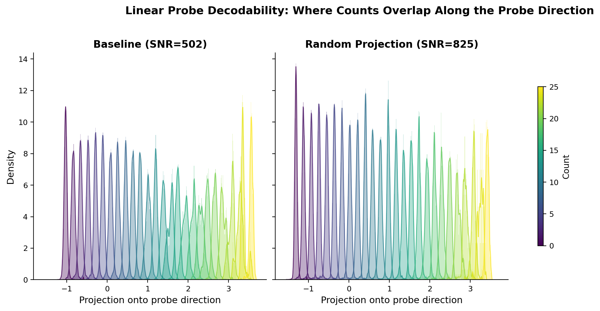
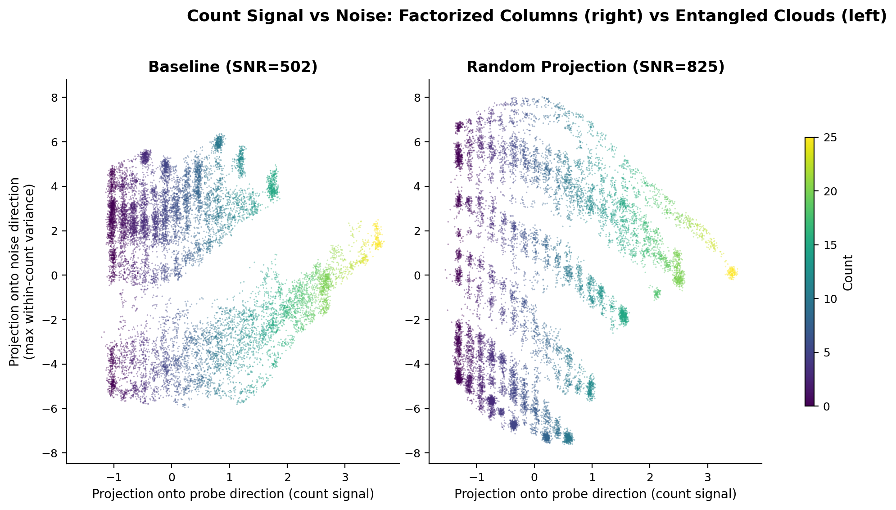
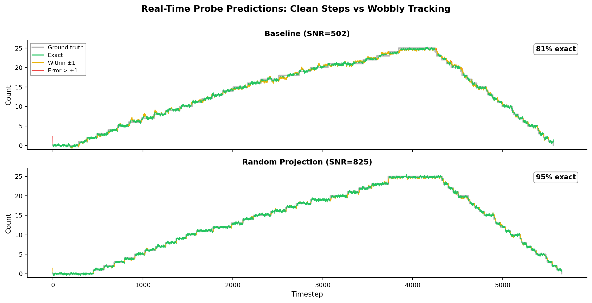

# Anim: Counting Emerges from Gathering

**Can an AI system develop a concept of number without being taught to count?**

No symbols. No language. No math instruction. Just the physical experience of gathering objects, one at a time.

We built a simple 2D world where a bot picks up blobs and places them on a grid. A [DreamerV3](https://arxiv.org/abs/2301.04104) world model watches and tries to predict what happens next. It receives no symbolic numerical instruction &mdash; no number labels, no counting curriculum, no concept of "how many." It just learns to predict what the world will look like one step from now.

Inside the model's 512-dimensional hidden state, a **number line emerges**.

Not approximately. A geometrically precise 1D arc where each position corresponds to a count, verified with tools from pure mathematics:
- **Persistent homology** confirms it's a line (not a loop, not a surface) &mdash; Betti numbers &beta;<sub>0</sub>=1, &beta;<sub>1</sub>=0
- **Geodesic analysis** confirms the spacing is uniform (like marks on a ruler) &mdash; arc-length R&sup2;=0.998
- **Representational similarity analysis** confirms the ordering is correct &mdash; RSA=0.982

The counting manifold is not fragile. It's an attractor. Every condition we tested &mdash; different spatial layouts, removed observations, scrambled identities, different architectures, higher dimensions &mdash; produced the same topological structure.

---

## The Setup

The counting world is deliberately simple. A 2D field contains 25 colored blobs. A bot navigates to each blob, picks it up, and carries it to a 5&times;5 grid. The environment exposes an 82-dimensional observation vector: the bot's position, all blob positions, which grid slots are filled, and a raw count of filled slots.

A DreamerV3 world model (~12 million parameters) observes the bot's behavior and learns to predict what the environment will look like next. The world model is trained on next-state prediction &mdash; its job is to simulate what happens next. The count appears as one element in the 82-dimensional observation, but the model receives no explicit counting loss, no number labels, and no symbolic instruction about what numbers are or how they work. Any numerical structure in the hidden state emerges from the model's need to predict the world accurately.

We then examine the model's internal representations. DreamerV3 uses a Recurrent State-Space Model (RSSM) with a 512-dimensional deterministic hidden state that accumulates information over time. We analyze the geometry of this hidden state to ask: did the model learn to count?

## The Core Finding

Yes. A linear probe (a single matrix multiply plus bias) applied to the 512-dimensional hidden state predicts the current count with R&sup2;=0.9996. The 26 per-count centroids in hidden-state space form a curved 1D arc &mdash; a number line &mdash; where:

- **Topology is correct**: Persistent homology gives &beta;<sub>0</sub>=1 (one connected component) and &beta;<sub>1</sub>=0 (no loops). This is the topology of a line segment, not a circle, not a surface, not a disconnected set.
- **Spacing is uniform**: The geodesic distance between consecutive count centroids is constant. This isn't just "the centroids are in the right order" &mdash; the distance from count 5 to count 6 is the same as the distance from count 20 to count 21. Arc-length R&sup2;=0.998 across 6 independent training seeds.
- **The metric is novel**: We developed Geodesic Homogeneity Error (GHE) to measure this properly. Standard Euclidean metrics reported high error because the manifold curves through 512-dimensional space. GHE follows the curve and reveals uniform spacing. Mean GHE=0.329&plusmn;0.027 across 6 seeds (threshold: <0.5).

## Robustness: We Tried to Break It

Every row in this table is a separate training run (200K steps, ~4 hours on an RTX 4090). Every single one produced a valid number line.

| Condition | What we changed | GHE | Topology | RSA |
|:---|:---|:---:|:---:|:---:|
| **Grid baseline** (6 seeds) | Nothing &mdash; control condition | 0.329&plusmn;0.027 | &beta;<sub>0</sub>=1, &beta;<sub>1</sub>=0 | 0.982 |
| **Line arrangement** | Blobs start in a line instead of scattered | 0.288 | &beta;<sub>0</sub>=1, &beta;<sub>1</sub>=0 | 0.982 |
| **Scatter arrangement** | Blobs start at random positions | 0.334 | &beta;<sub>0</sub>=1, &beta;<sub>1</sub>=0 | 0.980 |
| **Circle arrangement** | Blobs start in a ring | 0.394 | &beta;<sub>0</sub>=1, &beta;<sub>1</sub>=0 | 0.978 |
| **No count signal** | Masked the count from observations | 0.336&plusmn;0.091 | &beta;<sub>0</sub>=1, &beta;<sub>1</sub>=0 | 0.981 |
| **No slots + no count** | Masked both grid assignments and count | 0.344&plusmn;0.045 | &beta;<sub>0</sub>=1, &beta;<sub>1</sub>=0 | 0.981 |
| **Shuffled + starved** | Scrambled blob identities every frame, masked grid and count | 0.367&plusmn;0.081 | &beta;<sub>0</sub>=1, &beta;<sub>1</sub>=0 | 0.985 |
| **Random projection** (3 seeds) | Multiplied observations by a random orthogonal matrix | 0.326&plusmn;0.063 | &beta;<sub>0</sub>=1, &beta;<sub>1</sub>=0 | 0.983 |
| **Random permutation** (3 seeds) | Shuffled the order of observation dimensions | 0.346&plusmn;0.052 | &beta;<sub>0</sub>=1, &beta;<sub>1</sub>=0 | 0.981 |
| **LSTM** | Replaced DreamerV3 with a simple LSTM | 0.379 | &beta;<sub>0</sub>=1, &beta;<sub>1</sub>=0 | 0.980 |
| **Embodied agent** | Agent learns to steer and gather autonomously | 0.443 | &beta;<sub>0</sub>=1, &beta;<sub>1</sub>=0 | 0.806 |
| **Multi-dim D=2** | Gathering in 2D (mixed training across 2D-5D) | 0.439 | &beta;<sub>0</sub>=1, &beta;<sub>1</sub>=0 | 0.943 |
| **Multi-dim D=3** | Gathering in 3D | 0.325 | &beta;<sub>0</sub>=1, &beta;<sub>1</sub>=0 | 0.954 |

The manifold is not an accident. It's the natural representation for a system that needs to predict what happens when objects are gathered one at a time.

## The Random Projection Surprise

This was the most unexpected finding of the project.

We multiplied the 82-dimensional observation vector by a random orthogonal matrix before feeding it to the model. This preserves all pairwise distances between observations (it's a rotation in high-dimensional space) but destroys all spatial semantics &mdash; dimension 1 is no longer "bot x-position," it's a meaningless blend of everything.

The model should have performed identically. Information theory says the task is the same. Instead:

**The random projection model performed dramatically better at real-time count tracking.**

| Metric | Baseline | Random Projection |
|:---|:---:|:---:|
| GHE (manifold quality) | 0.329 | 0.326 |
| Probe SNR (signal-to-noise) | 502 | 825 |
| Live probe accuracy | 56% exact | 99% exact |
| PaCMAP R&sup2; (multi-scale structure) | 0.651 | 0.976 |

The standard evaluation metrics (GHE, topology, RSA) showed no difference. They declared the two models equivalent. Only when we built a real-time visualization and watched the models actually predict did we discover the gap. The baseline model tracked counts with a noticeable wobble &mdash; it would lag behind transitions and oscillate between adjacent counts. The random projection model snapped to each count precisely.

We developed a new metric, **probe SNR** (signal-to-noise ratio along the probe direction), that captures this. SNR measures how tightly the hidden states cluster around each count centroid relative to how far apart the centroids are. It's the difference between "the counts are in the right order" (both models) and "the counts are cleanly separated" (only the random projection model).

Why does scrambling help? The default observation format &mdash; paired x/y coordinates, contiguous grid slots, isolated scalars &mdash; provides shortcuts. The model can exploit the coordinate structure directly instead of building a robust counting representation. Random projection removes these shortcuts, forcing the model to extract counting from the dynamics of change rather than from spatial templates. A random permutation of observation dimensions (which reorders but doesn't mix) produces nearly the same improvement (PaCMAP R&sup2; 0.953), confirming that the mechanism is **coordinate-structure disruption**, not information mixing.

### The three figures tell this story visually:

<p align="center">
  
</p>

**Figure 1: Where counts live along the probe direction.** Each colored curve is one count value (0-25). Left: baseline model &mdash; the peaks overlap significantly, making it hard to tell adjacent counts apart. Right: random projection model &mdash; the peaks are sharply separated. Same model architecture, same training, same task. The only difference is scrambling the observations.

<p align="center">
  
</p>

**Figure 2: Count signal versus noise.** Horizontal axis: projection onto the counting direction. Vertical axis: projection onto the direction of maximum within-count variance (spatial noise). Left: baseline &mdash; the count clusters are entangled with spatial information, forming smeared diagonal clouds. Right: random projection &mdash; the count clusters are tight vertical columns, cleanly factorized from spatial variation. The model has learned to separate "what number" from "what arrangement."

<p align="center">
  
</p>

**Figure 3: Real-time count prediction.** Ground truth count (gray staircase) versus the model's probe prediction over ~5,500 timesteps of a full counting-and-uncounting episode. Top: baseline (81% exact) &mdash; the prediction tracks the true count but wobbles at transitions. Bottom: random projection (95% exact) &mdash; the prediction snaps cleanly to each integer. Green = exact, orange = within &plusmn;1, red = larger error. This difference is invisible to standard manifold metrics.

## Cross-Dimensional Counting

We parameterized the world so the bot gathers blobs in 2D, 3D, 4D, or 5D space, with observations projected through a random matrix to a fixed 128-dimensional input. A single model trained across all dimensionalities simultaneously.

**The topology is dimension-invariant.** Every dimensionality tested produces &beta;<sub>0</sub>=1, &beta;<sub>1</sub>=0 &mdash; a line. The concept of counting doesn't change when the world gets more dimensions.

**The neurons are completely different.** Linear probe transfer between dimensionalities fails catastrophically (mean R&sup2; = -0.27). Hidden state anatomy reveals the model uses entirely different neurons to count in each dimensionality &mdash; dimension 503 for 2D, dimension 115 for 3D, dimension 188 for 4D, dimension 240 for 5D. Zero overlap in the top-20 counting dimensions across any pair.

**The geometry is identical.** Gromov-Wasserstein distance (a metric that compares the *shape* of two manifolds without requiring point correspondence) reveals that the counting structures at different dimensionalities are geometrically indistinguishable &mdash; cross-dimensional GW distances (0.004) are actually *below* the self-comparison baseline (0.010). The model builds the same ruler in different corners of its hidden state.

The concept is dimension-invariant. The implementation is not.

## The Successor Function

What does "+1" look like inside the model?

We characterized the step vectors &mdash; the change in hidden state when count goes from *n* to *n*+1 &mdash; across the entire manifold. Key findings:

- **It's not a single direction.** The +1 operation rotates through 512-dimensional space, requiring 11 principal components to capture 90% of its variance. The step from 0&rarr;1 and the step from 24&rarr;25 point in nearly opposite directions (cosine similarity near zero).
- **But the step sizes are uniform.** Despite rotating through high-dimensional space, every +1 step covers the same geodesic distance. The manifold has constant speed but varying curvature &mdash; like a road that turns but maintains a steady 60 mph.
- **The model anticipates.** The hidden state begins shifting toward the next count 2-50 timesteps *before* a blob actually lands on the grid. The anticipation interval is proportional to the blob's travel distance. The model predicts counting events before they happen.
- **The prior knows the count.** The model's internal prediction (before seeing the current observation) achieves R&sup2;=0.956 on count. The counting manifold lives in the recurrent dynamics &mdash; the model's accumulated memory &mdash; not in the current observation. The observation barely adds information. The model has internalized counting so thoroughly that it rarely needs to check.

## The Measurement Battery

Standard metrics missed important differences between our models. We built a comprehensive toolkit:

| Tool | What it measures | What it found |
|:---|:---|:---|
| **Persistent homology** | Topological structure (Betti numbers) | &beta;<sub>0</sub>=1, &beta;<sub>1</sub>=0 in every condition tested |
| **Geodesic Homogeneity Error** | Uniformity of successor spacing | GHE<0.5 in all conditions; replaced Euclidean HE which was measuring curvature, not error |
| **Representational Similarity Analysis** | Ordinal structure preservation | RSA>0.97 consistently |
| **Probe SNR** | Linear decodability quality | Revealed 56% vs 99% accuracy gap invisible to all other metrics |
| **PaCMAP / TriMap R&sup2;** | Multi-scale projection fidelity | PaCMAP R&sup2;: 0.651 (baseline) vs 0.976 (random projection) |
| **Gromov-Wasserstein distance** | Cross-condition geometry comparison | Proved identical geometry in disjoint subspaces |
| **Hidden state anatomy** | Per-dimension counting contribution | 1-4 dims carry 95% of counting signal; completely different dims per condition |
| **Transition detectors** | Temporal dynamics at count changes | 100+ dimensions respond per transition; anticipation precedes blob landing |
| **Prior vs posterior** | Causal prediction analysis | R&sup2;=0.956 from recurrent state alone |

The probe SNR finding &mdash; where a transformation that doesn't change standard metrics dramatically improves practical performance &mdash; is, to our knowledge, undocumented in the representation learning literature.

## Interactive Visualization

The repository includes an interactive synchronized visualization:

- **Left panel**: The 2D counting world &mdash; bot gathering blobs in real time
- **Right panel**: The model's 512-dimensional hidden state projected onto three semantically meaningful axes:
  - **Count axis**: The probe direction &mdash; position along this axis is the model's count estimate
  - **Spatial axis**: Within-count variance &mdash; how the representation differs at the same count with different blob arrangements
  - **Transition axis**: Velocity at count changes &mdash; the magnitude of the whole-network response when a blob lands

```bash
cd scripts
python3 record_educational_episode.py --weights-dir ../models/randproj_clean --out ../artifacts/episodes/episode.npz
python3 educational_viz.py --episode ../artifacts/episodes/episode.npz
```

Controls: Space (play/pause), arrows (step/jump), mouse drag (rotate 3D), D (dimension spotlight), P (probe line), H (PCA horseshoe), T (transition slow-mo).

## What It Means

**For cognitive science.** Numerical structure can emerge from physical experience alone, without symbols, language, or instruction. This supports embodied theories of mathematical cognition &mdash; the idea that number concepts are grounded in bodily interaction with the world, not in abstract symbol manipulation. The model develops what looks like a rudimentary [approximate number system](https://en.wikipedia.org/wiki/Approximate_number_system) purely from the dynamics of gathering.

**For AI.** World models develop geometrically precise internal representations that standard evaluation tools miss. The gap between our baseline and random projection models was invisible to every standard metric. Only building a real-time demo, watching it run, and then developing a new metric (probe SNR) revealed the difference. Multi-scale measurement matters. Watching your model matters.

**For the future.** Counting is the first step. If a model can develop number from gathering, it should be able to develop classification from sorting, conservation from pouring, addition from combining, and subtraction from removing. Each concept should produce a distinct geometric signature in the hidden state. The measurement tools are built. The architecture works. The curriculum is mapped.

## Reproducing Key Results

### Requirements

```bash
pip install -r requirements.txt
```

### Training a model (GPU recommended, ~4 hours on RTX 4090)

```bash
cd scripts
# Baseline
python3 train.py --config grid_baseline --steps 200000

# Random projection (best real-time accuracy)
python3 train.py --config grid_randproj --steps 200000
```

### Running the evaluation battery

```bash
cd scripts
# Full battery: GHE, topology, RSA, probe SNR, projections
python3 full_battery.py --checkpoint-dir ../artifacts/checkpoints/YOUR_RUN
```

### Generating figures

```bash
cd scripts
python3 visualize_probe_decodability.py  # The three key figures
python3 generate_figures_v2.py           # Publication figures
```

Pretrained weights for the random projection model (our best) are included in `models/randproj_clean/`.

## Repository Structure

```
anim-counting/
├── README.md
├── LICENSE                        # MIT
├── CITATION.cff
├── requirements.txt
├── figures/                       # Key figures for this README
│   ├── probe_histograms.png
│   ├── probe_vs_noise.png
│   └── probe_trace.png
├── models/
│   └── randproj_clean/            # Pretrained weights + probe + PCA
│       ├── dreamer_manifest.json
│       ├── dreamer_weights.bin
│       ├── embed_probe.json
│       └── embed_pca.json
├── scripts/
│   ├── train.py                   # DreamerV3 training
│   ├── full_battery.py            # Complete evaluation suite
│   ├── counting_env_pure.py       # Pure Python environment (50x faster than JS)
│   ├── educational_viz.py         # Interactive 2D+3D visualization
│   ├── record_educational_episode.py
│   ├── visualize_counting.py      # Real-time manifold visualization
│   ├── hidden_state_anatomy.py    # Per-dimension analysis
│   ├── advanced_manifold_analysis.py  # jPCA, Gromov-Wasserstein, prior/posterior
│   ├── transition_detectors.py    # Temporal dynamics analysis
│   ├── successor_analysis.py      # Successor function characterization
│   ├── curve_characterization.py  # Manifold curvature analysis
│   ├── lstm_mlp_experiment.py     # Architecture independence ablation
│   └── ...
├── cloud/                         # RunPod GPU training scripts
├── artifacts/
│   ├── reports/                   # Analysis reports (markdown)
│   └── figures/                   # All generated figures
└── docs/
```

## Acknowledgments

This project was built by **major-scale** and **Claude** (Anthropic) working together. Claude served as the primary implementation agent &mdash; writing code, designing experiments, running evaluations, building analysis tools, and debugging the many things that went wrong along the way. major-scale provided the vision, the research direction, the critical judgment calls, and the "that doesn't look right" intuitions that repeatedly turned out to be correct.

The experimental workflow was unusual: a human and an AI collaborating in real time on a research project, with the AI writing and running all the code while the human steered the investigation. The random projection finding &mdash; the most surprising result &mdash; came from major-scale watching a real-time demo and noticing something the metrics had missed. The multi-dimensional experiment came from major-scale asking "what if the world had more dimensions?" The successor analysis came from major-scale wanting to know what +1 actually looks like inside the model. The AI built the tools; the human asked the questions.

We believe this style of collaboration &mdash; where AI handles implementation at scale while humans provide direction and judgment &mdash; will become increasingly common in research. This project is one example of what it looks like in practice.

## References

**Hafner et al. (2023)** &mdash; [Mastering Diverse Domains through World Models](https://arxiv.org/abs/2301.04104). DreamerV3. The world-model architecture this project builds on. DreamerV3 learns by building an internal simulation of its environment and practicing inside that simulation. It achieved human-level performance across dozens of games without changing any settings. We used it because it's small enough to analyze completely (~12M parameters) while being powerful enough to learn complex behavior.

**Dehaene (2011)** &mdash; *The Number Sense*. The foundational book on how brains represent number. Dehaene's work established that humans and many animals have an innate approximate number system &mdash; a mental number line where larger numbers are more compressed (Weber-Fechner law). Our model develops a number line too, but with uniform spacing rather than logarithmic compression, suggesting a different origin (discrete gathering vs. approximate estimation).

**Lakoff & N&uacute;&ntilde;ez (2000)** &mdash; *Where Mathematics Comes From*. The argument that mathematical concepts are grounded in physical experience and metaphor, not Platonic abstraction. Our finding that counting emerges from gathering &mdash; without any mathematical instruction &mdash; provides computational evidence for this view.

**Nieder & Dehaene (2009)** &mdash; [Representation of Number in the Brain](https://doi.org/10.1146/annurev.neuro.051508.135550). Comprehensive review of how neurons in prefrontal and parietal cortex encode number. Individual neurons show tuned responses to specific numerosities, with tuning curves that overlap (similar to our probe histograms). Our model's hidden state dimensions show analogous tuning.

**Whittington et al. (2020)** &mdash; [The Tolman-Eichenbaum Machine](https://doi.org/10.1016/j.cell.2020.10.024). Shows how hippocampal-entorhinal circuits learn relational structure. Relevant because our model's counting manifold is a kind of cognitive map &mdash; a structured internal representation of an abstract relationship (numerical order), learned from experience.

**Churchland et al. (2012)** &mdash; [Neural Population Dynamics During Reaching](https://doi.org/10.1038/nature11129). Introduced jPCA for finding rotational dynamics in neural populations. We applied jPCA to our model's hidden states and found the counting manifold is *not* rotational (rotation fraction = -0.14), confirming it's fundamentally different from motor cortex dynamics.

**M&eacute;moli (2011)** &mdash; [Gromov-Wasserstein Distances and the Metric Approach to Object Matching](https://doi.org/10.1007/s10208-011-9093-5). The mathematical framework behind our cross-dimensional geometry comparison. Gromov-Wasserstein distance compares the *shape* of two metric spaces without requiring point-to-point correspondence. This is how we proved the counting manifolds at different dimensionalities are geometrically identical despite using completely different neurons.

**Edelsbrunner & Harer (2010)** &mdash; *Computational Topology*. The textbook on persistent homology, the tool we use to verify that the counting manifold has the topology of a line (&beta;<sub>0</sub>=1, &beta;<sub>1</sub>=0). Persistent homology tracks how topological features (connected components, loops, voids) appear and disappear as you vary a scale parameter.

**Kriegeskorte et al. (2008)** &mdash; [Representational Similarity Analysis](https://doi.org/10.3389/neuro.06.004.2008). The framework for comparing representational geometry across systems. RSA compares distance matrices rather than individual representations, making it possible to ask "do these two systems organize information the same way?" We use it to confirm ordinal structure preservation.

**McInnes et al. (2018)** &mdash; [UMAP](https://arxiv.org/abs/1802.03426). Uniform Manifold Approximation and Projection. A dimensionality reduction technique that preserves both local and global structure. We validated our manifold with the related techniques PaCMAP and TriMap, which revealed quality differences invisible to PCA.

**Friston (2010)** &mdash; [The Free-Energy Principle](https://doi.org/10.1038/nrn2787). The theoretical framework suggesting that brains minimize surprise by building predictive models of their environment. Our finding that the model anticipates count transitions (the prior achieves R&sup2;=0.956 before seeing the observation) is a concrete example of active inference &mdash; the model has internalized the dynamics so thoroughly that observation is almost redundant.

**Spelke (2000)** &mdash; [Core Knowledge](https://doi.org/10.1037/0003-066X.55.11.1233). Elizabeth Spelke's theory that humans are born with core knowledge systems for objects, number, space, and agents. Our model's ability to develop numerical structure from pure observation parallels the idea of a core number system &mdash; though our model builds it from experience rather than having it innately.

**Kim & Mnih (2018)** &mdash; [Disentangled Representations](https://arxiv.org/abs/1802.04942). Work on learning factorized representations where different factors of variation are separated. Our random projection finding is relevant: the scrambled model achieves better factorization (count signal cleanly separated from spatial noise) than the baseline, suggesting that input structure can *hinder* disentanglement.

**Saxe et al. (2019)** &mdash; [A Mathematical Theory of Semantic Development](https://doi.org/10.1073/pnas.1820226116). Shows how neural networks can develop structured internal representations through learning. Provides theoretical grounding for why a next-state prediction objective leads to semantically meaningful representations.

**Ramsauer et al. (2020)** &mdash; [Hopfield Networks Is All You Need](https://arxiv.org/abs/2008.02217). Modern Hopfield networks and their connection to attention mechanisms and memory. Relevant to understanding how recurrent dynamics in our RSSM maintain count information across time without explicit counting objectives.

---

*This project was built with [Claude Code](https://claude.ai/code) as the primary implementation agent.*

*Counting, it appears, is not taught. It is gathered.*
