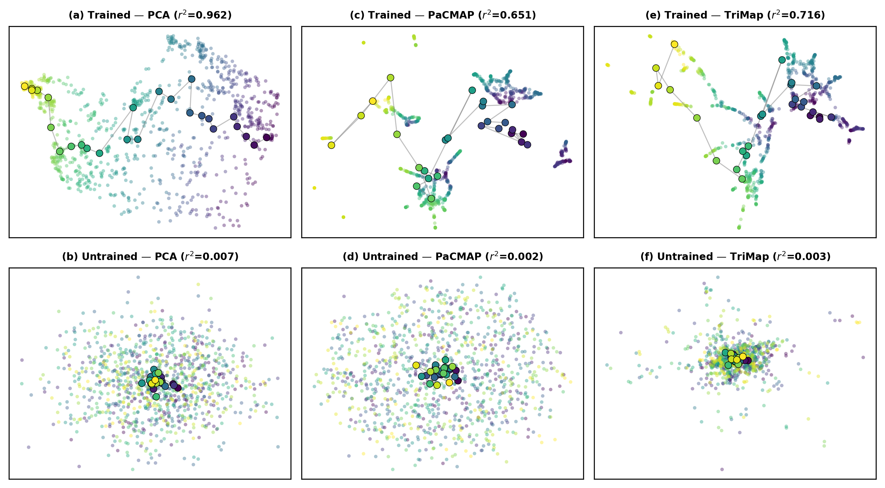

# Anim: Counting Emerges from Gathering

**Can an AI system develop a representation of number without being taught to count?**

No symbols, language, or instruction. Just the physical experience of gathering objects, one at a time.

We built a simple 2D world where a bot picks up blobs and places them on a grid. A [DreamerV3](https://arxiv.org/abs/2301.04104) world model watches and tries to predict what happens next. It receives no symbolic numerical instruction &mdash; no number labels, no counting curriculum, no concept of "how many." It just learns to predict what the world will look like one step from now.

Inside the model's 512-dimensional hidden state, a **number line emerges**.

Not approximately. A geometrically precise 1D arc where each position corresponds to a count, verified with tools from pure mathematics:

- **Persistent homology** confirms it's contractible (not a loop, not a surface) &mdash; Betti numbers &beta;<sub>0</sub>=1, &beta;<sub>1</sub>=0. Intrinsic dimensionality estimates (TwoNN&asymp;5.5, MLE&asymp;7.6) confirm the manifold is low-dimensional, consistent with a curved 1D arc embedded in higher-dimensional space
- **Geodesic analysis** confirms the spacing is uniform (like marks on a ruler) &mdash; arc-length R&sup2;=0.998
- **Representational similarity analysis** confirms the ordering is correct &mdash; RSA=0.982

The counting manifold is not fragile. It appears reliably across every condition we tested &mdash; different spatial layouts, removed observations, scrambled identities, different architectures, higher dimensions &mdash; all produced the same topological structure.

---

## The Setup

The counting world is deliberately simple. A 2D field contains 25 colored blobs. A bot navigates to each blob, picks it up, and carries it to a 5&times;5 grid. The environment exposes an 82-dimensional observation vector: the bot's position, all blob positions, which grid slots are filled, and a raw count of filled slots.

A DreamerV3 world model (~12 million parameters) observes the bot's behavior and learns to predict what the environment will look like next. The world model is trained on next-state prediction &mdash; its job is to simulate what happens next. The count appears as one element in the 82-dimensional observation, but the model receives no explicit counting loss, no number labels, and no symbolic instruction about what numbers are or how they work. Any numerical structure in the hidden state emerges from the model's need to predict the world accurately.

We then examine the model's internal representations. DreamerV3 uses a Recurrent State-Space Model (RSSM) with a 512-dimensional deterministic hidden state that accumulates information over time. We analyze the geometry of this hidden state to ask: did the model learn to count?

## The Core Finding

Yes. A linear probe (a single matrix multiply plus bias) applied to the 512-dimensional hidden state predicts the current count with R&sup2;=0.9996. The 26 per-count centroids in hidden-state space form a curved 1D arc &mdash; a number line &mdash; where:

- **Topology is consistent with a line**: Persistent homology gives &beta;<sub>0</sub>=1 (one connected component) and &beta;<sub>1</sub>=0 (no loops). These Betti numbers rule out circles, surfaces, and disconnected sets. They do not uniquely identify a line (any contractible space produces the same numbers), but intrinsic dimensionality estimates (~5-9 effective dimensions from 512) confirm the manifold is low-dimensional, and the arc-length analysis below confirms 1D sequential structure.
- **Spacing is uniform**: The geodesic distance between consecutive count centroids is constant. This isn't just "the centroids are in the right order" &mdash; the distance from count 5 to count 6 is the same as the distance from count 20 to count 21. Arc-length R&sup2;=0.998 across 5 independent training seeds.
- **The metric is novel**: We developed Geodesic Homogeneity Error (GHE) to measure this properly. Standard Euclidean metrics reported high error because the manifold curves through 512-dimensional space. GHE follows the curve and reveals approximately uniform spacing. Mean GHE=0.329&plusmn;0.027 across 5 seeds (threshold: <0.5).

## Robustness: We Tried to Break It

Every row in this table is a separate training run (50K–300K steps). Every single one produced a valid number line.

| Condition                        | What we changed                                              |        GHE         |                  Topology                  |  RSA  |
| :------------------------------- | :----------------------------------------------------------- | :----------------: | :----------------------------------------: | :---: |
| **Grid baseline** (5 seeds)      | Nothing &mdash; control condition                            | 0.329&plusmn;0.027 | &beta;<sub>0</sub>=1, &beta;<sub>1</sub>=0 | 0.982 |
| **Line arrangement**             | Blobs start in a line instead of scattered                   |       0.288        | &beta;<sub>0</sub>=1, &beta;<sub>1</sub>=0 | 0.982 |
| **Scatter arrangement**          | Blobs start at random positions                              |       0.334        | &beta;<sub>0</sub>=1, &beta;<sub>1</sub>=0 | 0.980 |
| **Circle arrangement**           | Blobs start in a ring                                        |       0.394        | &beta;<sub>0</sub>=1, &beta;<sub>1</sub>=0 | 0.978 |
| **No count signal**              | Masked the count from observations                           | 0.336&plusmn;0.091 | &beta;<sub>0</sub>=1, &beta;<sub>1</sub>=0 | 0.981 |
| **No slots + no count**          | Masked both grid assignments and count                       | 0.344&plusmn;0.045 | &beta;<sub>0</sub>=1, &beta;<sub>1</sub>=0 | 0.981 |
| **Shuffled + starved**           | Scrambled blob identities every frame, masked grid and count | 0.367&plusmn;0.081 | &beta;<sub>0</sub>=1, &beta;<sub>1</sub>=0 | 0.985 |
| **Random projection** (3 seeds)  | Multiplied observations by a random orthogonal matrix        | 0.326&plusmn;0.063 | &beta;<sub>0</sub>=1, &beta;<sub>1</sub>=0 | 0.983 |
| **Random permutation** (3 seeds) | Shuffled the order of observation dimensions                 | 0.346&plusmn;0.052 | &beta;<sub>0</sub>=1, &beta;<sub>1</sub>=0 | 0.981 |
| **LSTM**                         | Replaced DreamerV3 with a simple LSTM                        |       0.379        | &beta;<sub>0</sub>=1, &beta;<sub>1</sub>=0 | 0.980 |
| **Embodied agent**               | Agent learns to steer and gather autonomously                |       0.443        | &beta;<sub>0</sub>=1, &beta;<sub>1</sub>=0 | 0.806 |
| **Multi-dim D=2**                | Gathering in 2D (mixed training across 2D-5D)                |       0.439        | &beta;<sub>0</sub>=1, &beta;<sub>1</sub>=0 | 0.943 |
| **Multi-dim D=3**                | Gathering in 3D                                              |       0.325        | &beta;<sub>0</sub>=1, &beta;<sub>1</sub>=0 | 0.954 |

The manifold does not appear to be an accident. It emerged consistently across every condition we tested, suggesting it is a reliable outcome of learning to predict gathering dynamics.

**An important caveat:** All evidence above is correlational. We show that a counting-correlated geometric structure exists in the hidden state and persists across conditions, but we have not performed causal interventions &mdash; modifying the hidden state along the manifold and verifying that downstream predictions change accordingly. Following the standard established by Othello-GPT (Li et al. 2023; Nanda et al. 2023), causal validation would be needed to confirm that the model _uses_ this representation rather than merely _contains_ it. The prior R&sup2;=0.956 (see Successor Function section) provides indirect evidence of functional use, but is not a substitute for intervention experiments.

## The Random Projection Surprise

This was the most unexpected finding of the project.

We multiplied the 82-dimensional observation vector by a random orthogonal matrix before feeding it to the model. This preserves all pairwise distances between observations (it's a rotation in high-dimensional space) but destroys all spatial semantics &mdash; dimension 1 is no longer "bot x-position," it's a meaningless blend of everything.

**The random projection model performed dramatically better at real-time count tracking.**

| Metric                                 | Baseline  | Random Projection |
| :------------------------------------- | :-------: | :---------------: |
| GHE (manifold quality)                 |   0.329   |       0.326       |
| Probe SNR (signal-to-noise)            |    502    |        825        |
| Live probe accuracy (per episode)      | 81% exact |     95% exact     |
| PaCMAP R&sup2; (multi-scale structure) |   0.651   |       0.976       |

The standard evaluation metrics (GHE, topology, RSA) showed no difference. They declared the two models equivalent. Only when we built a real-time visualization and watched the models actually predict did we discover the gap. The baseline model tracked counts with a noticeable wobble &mdash; it would lag behind transitions and oscillate between adjacent counts. The random projection model snapped to each count precisely.

We developed a new metric, **probe SNR** (signal-to-noise ratio along the probe direction), that captures this. SNR measures how tightly the hidden states cluster around each count centroid relative to how far apart the centroids are. It's the difference between "the counts are in the right order" (both models) and "the counts are cleanly separated" (only the random projection model).

Why does scrambling help? The default observation format &mdash; paired x/y coordinates, contiguous grid slots, isolated scalars &mdash; provides shortcuts. The model can exploit the coordinate structure directly instead of building a robust counting representation. Random projection removes these shortcuts, forcing the model to extract counting from the dynamics of change rather than from spatial templates. A random permutation of observation dimensions (which reorders but doesn't mix) produces nearly the same improvement (PaCMAP R&sup2; 0.953), confirming that the mechanism is **coordinate-structure disruption**, not information mixing.

This finding recapitulates mechanisms well-documented in the shortcut learning literature &mdash; Geirhos et al. (2020) defined the phenomenon; Shah et al. (2020) formally characterized the simplicity bias that drives it; and in RL specifically, Lee et al. (2020), Laskin et al. (2020), and Kostrikov et al. (2021) showed that random augmentations improve representation quality. Our contribution is not the mechanism itself but the **Probe SNR metric** that revealed a dissociation invisible to all standard manifold metrics, and the specific demonstration that coordinate-structure shortcuts degrade counting representations even when topological and geometric summary statistics remain unchanged.

### The three figures tell this story visually:

<p align="center">
  
</p>

**Figure 1: Where counts live along the probe direction.** Each colored curve is one count value (0-25). Left: baseline model &mdash; the peaks overlap significantly, making it hard to tell adjacent counts apart. Right: random projection model &mdash; the peaks are sharply separated. Same model architecture, same training, same task. The only difference is scrambling the observations.

<p align="center">
  
</p>

**Figure 2: Count signal versus noise.** Horizontal axis: projection onto the counting direction. Vertical axis: projection onto the direction of maximum within-count variance (spatial noise). Left: baseline &mdash; the count clusters are entangled with spatial information, forming smeared diagonal clouds. Right: random projection &mdash; the count clusters are tight vertical columns, cleanly factorized from spatial variation. The model has learned to separate "what number" from "what arrangement."

<p align="center">
  
</p>

**Figure 3: Real-time count prediction.** Ground truth count (gray staircase) versus the model's probe prediction over ~5,500 timesteps of a full counting-and-uncounting episode. Top: baseline (81% exact) &mdash; the prediction tracks the true count but wobbles at transitions. Bottom: random projection (95% exact) &mdash; the prediction snaps cleanly to each integer. Green = exact, orange = within &plusmn;1, red = larger error. This difference is invisible to standard manifold metrics.

## Cross-Dimensional Counting

We parameterized the world so the bot gathers blobs in 2D, 3D, 4D, or 5D space, with observations projected through a random matrix to a fixed 128-dimensional input. A single model trained across all dimensionalities simultaneously.

**The topology is dimension-invariant.** Every dimensionality tested produces &beta;<sub>0</sub>=1, &beta;<sub>1</sub>=0 &mdash; a line. The topological structure of the counting representation doesn't change when the world gets more dimensions.

**The neurons are completely different.** Linear probe transfer between dimensionalities fails catastrophically (mean R&sup2; = -0.27). Hidden state anatomy reveals the model uses entirely different neurons to count in each dimensionality &mdash; dimension 503 for 2D, dimension 115 for 3D, dimension 188 for 4D, dimension 240 for 5D. Zero overlap in the top-20 counting dimensions across any pair.

**The geometry is closely matched.** Gromov-Wasserstein distance (a metric that compares the _shape_ of two manifolds without requiring point correspondence) shows that the counting structures at different dimensionalities are geometrically very similar &mdash; cross-dimensional GW distances (0.004) are actually _below_ the self-comparison baseline (0.010). The model appears to build a similar ruler in different corners of its hidden state.

The structure is dimension-invariant. The implementation is not.

## The Successor Function

What does "+1" look like inside the model?

We characterized the step vectors &mdash; the change in hidden state when count goes from _n_ to _n_+1 &mdash; across the entire manifold. Key findings:

- **It's not a single direction.** The +1 operation rotates through 512-dimensional space, requiring 11 principal components to capture 90% of its variance. The step from 0&rarr;1 and the step from 24&rarr;25 point in nearly opposite directions (cosine similarity near zero).
- **But the step sizes are uniform.** Despite rotating through high-dimensional space, every +1 step covers the same geodesic distance. The manifold has constant speed but varying curvature.
- **The model anticipates.** The hidden state begins shifting toward the next count 2-50 timesteps _before_ a blob actually lands on the grid. The anticipation interval is proportional to the blob's travel distance. The model predicts counting events before they happen.
- **The prior knows the count.** The model's internal prediction (before seeing the current observation) achieves R&sup2;=0.956 on count. Most of the counting information lives in the recurrent dynamics &mdash; the model's accumulated memory &mdash; rather than in the current observation, though the observation still contributes meaningful updates.

## The Measurement Battery

| Tool                                     | What it measures                      | What it found                                                                             |
| :--------------------------------------- | :------------------------------------ | :---------------------------------------------------------------------------------------- |
| **Persistent homology**                  | Topological structure (Betti numbers) | &beta;<sub>0</sub>=1, &beta;<sub>1</sub>=0 in every condition tested                      |
| **Geodesic Homogeneity Error**           | Uniformity of successor spacing       | GHE<0.5 in all conditions; replaced Euclidean HE which was measuring curvature, not error |
| **Representational Similarity Analysis** | Ordinal structure preservation        | RSA>0.97 consistently                                                                     |
| **Probe SNR**                            | Linear decodability quality           | Revealed 81% vs 95% accuracy gap invisible to all other metrics                           |
| **PaCMAP / TriMap R&sup2;**              | Multi-scale projection fidelity       | PaCMAP R&sup2;: 0.651 (baseline) vs 0.976 (random projection)                             |
| **Gromov-Wasserstein distance**          | Cross-condition geometry comparison   | Found closely matching geometry in disjoint subspaces                                     |
| **Hidden state anatomy**                 | Per-dimension counting contribution   | 1-4 dims carry 95% of counting signal; completely different dims per condition            |
| **Transition detectors**                 | Temporal dynamics at count changes    | 100+ dimensions respond per transition; anticipation precedes blob landing                |
| **Prior vs posterior**                   | Recurrent vs. observational signal    | R&sup2;=0.956 from recurrent state alone                                                  |

## What It Means

**For cognitive science.** These findings are consistent with embodied theories of mathematical cognition &mdash; the idea that number concepts are grounded in bodily interaction with the world, not in abstract symbol manipulation. The model's hidden-state geometry is consistent with the view that numerical structure can emerge from physical experience alone, without symbols, language, or instruction. The internal representation resembles a rudimentary [approximate number system](https://en.wikipedia.org/wiki/Approximate_number_system), though we make no strong claims about its relationship to biological number sense.

**For AI evaluation methodology.** Our standard manifold metrics (GHE, topology, RSA) declared the baseline and random projection models equivalent. They were not. Only when we built a real-time visualization and developed probe SNR did the 81% vs 95% accuracy gap become visible. This suggests that summary statistics on centroids can miss important differences in representation quality, and that real-time behavioral probing &mdash; watching the model actually use its representations &mdash; should be part of the evaluation toolkit.

## Reproducing Key Results

### Requirements

```bash
pip install -r requirements.txt
```

### Training a model (GPU recommended, ~4 hours on RTX 4090)

```bash
cd scripts
# Baseline
python3 train.py --config grid_baseline --steps 200000

# Random projection (best real-time accuracy)
python3 train.py --config grid_randproj --steps 200000
```

### Running the evaluation battery

```bash
cd scripts
# Full battery: GHE, topology, RSA, probe SNR, projections
python3 full_battery.py --checkpoint-dir ../artifacts/checkpoints/YOUR_RUN
```

### Generating figures

```bash
cd scripts
python3 visualize_probe_decodability.py  # The three key figures
python3 generate_figures_v2.py           # Publication figures
```

Pretrained weights for the random projection model (our best) are included in `models/randproj_clean/`.

## Repository Structure

```
anim-counting/
├── README.md
├── LICENSE                        # MIT
├── CITATION.cff
├── requirements.txt
├── figures/                       # Key figures for this README
│   ├── probe_histograms.png
│   ├── probe_vs_noise.png
│   └── probe_trace.png
├── models/
│   └── randproj_clean/            # Pretrained weights + probe + PCA
│       ├── dreamer_manifest.json
│       ├── dreamer_weights.bin
│       ├── embed_probe.json
│       └── embed_pca.json
├── scripts/
│   ├── train.py                   # DreamerV3 training
│   ├── full_battery.py            # Complete evaluation suite
│   ├── counting_env_pure.py       # Pure Python environment (50x faster than JS)
│   ├── educational_viz.py         # Interactive 2D+3D visualization
│   ├── record_educational_episode.py
│   ├── visualize_counting.py      # Real-time manifold visualization
│   ├── hidden_state_anatomy.py    # Per-dimension analysis
│   ├── advanced_manifold_analysis.py  # jPCA, Gromov-Wasserstein, prior/posterior
│   ├── transition_detectors.py    # Temporal dynamics analysis
│   ├── successor_analysis.py      # Successor function characterization
│   ├── curve_characterization.py  # Manifold curvature analysis
│   ├── lstm_mlp_experiment.py     # Architecture independence ablation
│   └── ...
├── cloud/                         # RunPod GPU training scripts
├── artifacts/
│   ├── reports/                   # Analysis reports (markdown)
│   └── figures/                   # All generated figures
└── docs/
```

## Acknowledgments

This project was built by **major-scale** and **Claude** (Anthropic) working together.

## References

**Hafner et al. (2023)** &mdash; [Mastering Diverse Domains through World Models](https://arxiv.org/abs/2301.04104). DreamerV3. The world-model architecture this project builds on. DreamerV3 learns by building an internal simulation of its environment and practicing inside that simulation. It achieved human-level performance across dozens of games without changing any settings. We used it because it's small enough to analyze completely (~12M parameters) while being powerful enough to learn complex behavior.

**Dehaene (2011)** &mdash; _The Number Sense_. The foundational book on how brains represent number. Dehaene's work established that humans and many animals have an innate approximate number system &mdash; a mental number line where larger numbers are more compressed (Weber-Fechner law). Our model develops a number line too, but with uniform spacing rather than logarithmic compression, suggesting a different origin (discrete gathering vs. approximate estimation).

**Lakoff & N&uacute;&ntilde;ez (2000)** &mdash; _Where Mathematics Comes From_. The argument that mathematical concepts are grounded in physical experience and metaphor, not Platonic abstraction. Our observation that counting-like structure emerges from gathering &mdash; without any mathematical instruction &mdash; is consistent with this view.

**Nieder & Dehaene (2009)** &mdash; [Representation of Number in the Brain](https://doi.org/10.1146/annurev.neuro.051508.135550). Comprehensive review of how neurons in prefrontal and parietal cortex encode number. Individual neurons show tuned responses to specific numerosities, with tuning curves that overlap (similar to our probe histograms). Our model's hidden state dimensions show superficially similar tuning, though the mechanisms are likely very different.

**Whittington et al. (2020)** &mdash; [The Tolman-Eichenbaum Machine](https://doi.org/10.1016/j.cell.2020.10.024). Shows how hippocampal-entorhinal circuits learn relational structure. Relevant because our model's counting manifold is a kind of cognitive map &mdash; a structured internal representation of an abstract relationship (numerical order), learned from experience.

**Churchland et al. (2012)** &mdash; [Neural Population Dynamics During Reaching](https://doi.org/10.1038/nature11129). Introduced jPCA for finding rotational dynamics in neural populations. We applied jPCA to our model's hidden states and found the counting manifold is _not_ rotational (rotation fraction = -0.14), confirming it's fundamentally different from motor cortex dynamics.

**M&eacute;moli (2011)** &mdash; [Gromov-Wasserstein Distances and the Metric Approach to Object Matching](https://doi.org/10.1007/s10208-011-9093-5). The mathematical framework behind our cross-dimensional geometry comparison. Gromov-Wasserstein distance compares the _shape_ of two metric spaces without requiring point-to-point correspondence. This is how we measured that the counting manifolds at different dimensionalities are geometrically very similar despite using completely different neurons.

**Edelsbrunner & Harer (2010)** &mdash; _Computational Topology_. The textbook on persistent homology, the tool we use to verify that the counting manifold has the topology of a line (&beta;<sub>0</sub>=1, &beta;<sub>1</sub>=0). Persistent homology tracks how topological features (connected components, loops, voids) appear and disappear as you vary a scale parameter.

**Kriegeskorte et al. (2008)** &mdash; [Representational Similarity Analysis](https://doi.org/10.3389/neuro.06.004.2008). The framework for comparing representational geometry across systems. RSA compares distance matrices rather than individual representations, making it possible to ask "do these two systems organize information the same way?" We use it to confirm ordinal structure preservation.

**McInnes et al. (2018)** &mdash; [UMAP](https://arxiv.org/abs/1802.03426). Uniform Manifold Approximation and Projection. A dimensionality reduction technique that preserves both local and global structure. We validated our manifold with the related techniques PaCMAP and TriMap, which revealed quality differences invisible to PCA.

**Friston (2010)** &mdash; [The Free-Energy Principle](https://doi.org/10.1038/nrn2787). The theoretical framework suggesting that brains minimize surprise by building predictive models of their environment. Our observation that the model anticipates count transitions (the prior achieves R&sup2;=0.956 before seeing the observation) is reminiscent of predictive processing &mdash; the model relies heavily on its internal dynamics, with observation providing refinement rather than the primary signal.

**Spelke (2000)** &mdash; [Core Knowledge](https://doi.org/10.1037/0003-066X.55.11.1233). Elizabeth Spelke's theory that humans are born with core knowledge systems for objects, number, space, and agents. Our model's development of numerical structure from observation is loosely reminiscent of a core number system, though the parallel is speculative &mdash; our model builds structure from experience in a very different substrate.

**Kim & Mnih (2018)** &mdash; [Disentangled Representations](https://arxiv.org/abs/1802.04942). Work on learning factorized representations where different factors of variation are separated. Our random projection finding is relevant: the scrambled model achieves better factorization (count signal cleanly separated from spatial noise) than the baseline, suggesting that input structure can _hinder_ disentanglement.

**Saxe et al. (2019)** &mdash; [A Mathematical Theory of Semantic Development](https://doi.org/10.1073/pnas.1820226116). Shows how neural networks can develop structured internal representations through learning. Provides theoretical grounding for why a next-state prediction objective leads to semantically meaningful representations.

**Ramsauer et al. (2020)** &mdash; [Hopfield Networks Is All You Need](https://arxiv.org/abs/2008.02217). Modern Hopfield networks and their connection to attention mechanisms and memory. Relevant to understanding how recurrent dynamics in our RSSM maintain count information across time without explicit counting objectives.

**Gurnee et al. (2025)** &mdash; [Counting in Claude](https://arxiv.org/abs/2601.04480). Found that Claude 3.5 Haiku represents character counts as 1D curved manifolds with sinc-function ringing structure, discretized by sparse feature families analogous to place cells. The closest concurrent work to ours: both find 1D counting manifolds emerging from prediction objectives. Their LLM setting counts tokens; our world-model setting counts gathered objects sequentially. Whether the manifold geometries are comparable remains an open question.

**Li et al. (2023)** &mdash; [Emergent World Representations](https://arxiv.org/abs/2210.13382). Showed that a GPT-scale model trained on Othello move sequences develops an internal board representation, verified through causal interventions. Extended by Nanda, Lee & Wattenberg (2023) with mechanistic analysis. Together these papers established the methodological standard for claiming emergent world models: probing is insufficient without causal validation. Our measurement battery exceeds Othello-GPT on the geometric side but does not yet include causal interventions.

**Stoianov & Zorzi (2012)** &mdash; [Emergence of Visual Number Sense in Hierarchical Generative Models](https://doi.org/10.1038/nn.3002). Demonstrated that numerosity-selective units emerge in deep belief networks trained on unsupervised visual tasks. The first evidence that counting-like representations arise without counting supervision, followed by Nasr et al. (2019) in CNNs and Kim et al. (2021) in untrained networks. Our contribution extends this line to sequential temporal counting in a recurrent world model, with topological and geometric verification.

**Geirhos et al. (2020)** &mdash; [Shortcut Learning in Deep Neural Networks](https://doi.org/10.1038/s42256-020-00257-z). The canonical reference defining shortcut learning &mdash; when models exploit surface-level correlations rather than learning intended features. Our random projection finding is an instance of this: the baseline model exploits coordinate-structure shortcuts instead of building a robust counting representation.

**Shah et al. (2020)** &mdash; [The Pitfalls of Simplicity Bias in Neural Networks](https://arxiv.org/abs/2006.07710). Formally characterized simplicity bias &mdash; networks preferring axis-aligned features over distributed ones. This is the mechanism behind our coordinate-structure disruption finding.

**Belinkov (2022)** &mdash; [Probing Classifiers: Promises, Shortcomings, and Advances](https://doi.org/10.1162/coli_a_00422). Comprehensive review of the limitations of linear probes for establishing that a model _uses_ a representation. High probe accuracy establishes decodability, not functional use. Our prior R&sup2;=0.956 provides indirect evidence of functional integration but does not replace the causal interventions Belinkov advocates.

**Cueva & Wei (2018)** &mdash; [Emergence of Grid-Like Representations by Training Recurrent Neural Networks to Perform Spatial Localization](https://arxiv.org/abs/1803.07770). Grid-cell-like spatial representations emerge in RNNs trained on path integration. The most direct paradigmatic precedent for our work: structured representations emerging in recurrent networks from task optimization, without explicit geometric supervision.

**Lee et al. (2020)** &mdash; [Network Randomization: A Simple Technique for Generalization in Deep Reinforcement Learning](https://arxiv.org/abs/1910.05396). Random network perturbations of RL observations improve generalization. Part of the shortcut-blocking literature that contextualizes our random projection finding.

**Laskin et al. (2020)** &mdash; [Reinforcement Learning with Augmented Data](https://arxiv.org/abs/2004.14990). Showed that simple random augmentations dramatically improve RL representation quality. Relevant context for why observation scrambling helps.

**Kostrikov et al. (2021)** &mdash; [Image Augmentation Is All You Need: Regularizing Deep Reinforcement Learning from Pixels](https://arxiv.org/abs/2004.13649). DrQ: data augmentation as implicit regularization in RL. Further context for our random projection result.

**Henderson et al. (2018)** &mdash; [Deep Reinforcement Learning That Matters](https://doi.org/10.1609/aaai.v32i1.11694). Demonstrated that 5 random seeds can produce Type I errors in RL experiments and established best practices for statistical reporting. Our 5-seed replication is below the standard this paper advocates.

**Agarwal et al. (2021)** &mdash; [Deep Reinforcement Learning at the Edge of the Statistical Precipice](https://arxiv.org/abs/2108.13264). NeurIPS Outstanding Paper. Recommends IQM with stratified bootstrap confidence intervals for RL evaluation. Our seed count and reporting would benefit from adopting this methodology.

## Deep Research: Detailed Evidence

This section shows the numbers behind the findings above, organized by result. All data comes from the analysis artifacts in `artifacts/`.

### Replication Across Random Seeds

The core finding replicates across 5 independent training seeds with different random initializations, training orderings, and hardware:

| Seed | Steps | Hardware |  GHE  | Arc R&sup2; |  RSA  |                  Topology                  |
| :--: | :---: | :------: | :---: | :---------: | :---: | :----------------------------------------: |
|  0   | 300K  | Mac MPS  | 0.327 |    0.998    | 0.984 | &beta;<sub>0</sub>=1, &beta;<sub>1</sub>=0 |
|  1   | 155K  | Mac MPS  | 0.331 |    0.997    | 0.978 | &beta;<sub>0</sub>=1, &beta;<sub>1</sub>=0 |
|  3   | 211K  | RTX 4090 | 0.374 |    0.996    | 0.975 | &beta;<sub>0</sub>=1, &beta;<sub>1</sub>=0 |
|  4   | 215K  | RTX 4090 | 0.288 |    0.998    | 0.983 | &beta;<sub>0</sub>=1, &beta;<sub>1</sub>=0 |
|  5   |  50K  | RTX 4090 | 0.324 |    0.995    | 0.984 | &beta;<sub>0</sub>=1, &beta;<sub>1</sub>=0 |

**Mean GHE: 0.329 &plusmn; 0.027.** Topology is unanimous. Seed 5 converged at only 50K steps, suggesting the structure forms early in training. Seed 4 achieved the best GHE (0.288), seed 3 the worst (0.374) &mdash; all comfortably below the 0.5 operational threshold.

Source: `artifacts/reports/replication_summary.json`

### The Untrained Control

To confirm the manifold is learned (not an artifact of the architecture), we ran an untrained DreamerV3 (random weights) on the exact same observation stream as a trained model:

| Metric                  | Trained | Untrained | Interpretation                               |
| :---------------------- | :-----: | :-------: | :------------------------------------------- |
| Probe R&sup2; (episode CV) |  0.993  |   0.120   | **Counting is learned, not architectural**    |
| Probe SNR               |   625   |   0.31    | **2000&times; gap in signal concentration**   |
| GHE                     |  0.281  |   0.395   | Spacing less uniform                         |
| Arc R&sup2;             |  0.998  |   0.985   | Slight ordering degradation                  |
| RSA                     |  0.982  |   0.591   | **Ordinal structure collapses**              |
| PCA PC1                 |  73.0%  |   23.0%   | **No dominant counting axis**                |

The table understates the gap. Visualizing all 117,212 hidden states (not just centroids) makes the difference visceral:

<p align="center">
  
</p>

**Figure 4: Trained vs. untrained &mdash; the same 117K hidden states projected three ways.** Top row: the trained model's states trace color-ordered arcs (count encoded as color, low&rarr;high = dark&rarr;light). Bottom row: the untrained model's states scatter like confetti &mdash; a uniform cloud with no count structure (r&sup2; &lt; 0.01 across all three projection methods). Both models saw identical observations. The structure is a product of learning, not of the data format or architecture.

Source: `artifacts/h_t_data/untrained_comparison.json`, `artifacts/h_t_data/random_baseline_full.json`

**A note on probe reliability.** Subsequent work on multi-specialist world models &mdash; combining counting and binary representations in a unified architecture &mdash; revealed that linear probe R&sup2; is not universally reliable as evidence of learned structure. In experiments where the target signal is distributed across many observation dimensions (such as a 4-bit binary register where count information is spread across 72 correlated dimensions), random untrained RSSMs score nearly as well as trained ones on probe R&sup2;. The counting task is different: the count signal occupies just 2 of 82 observation dimensions, requiring the model to actively extract and concentrate it. This is why the trained/untrained gap is so large here (R&sup2;: 0.993 vs 0.120; episode-level cross-validation with held-out episodes, not in-sample). For tasks where probe R&sup2; may be inflated, we developed a three-tier evaluation protocol (raw observations &rarr; random RSSM &rarr; trained RSSM) and identified metrics that survive random baseline controls: rollout divergence, MDL compression, exact count accuracy, topology, and RSA direction. Details in forthcoming work on the FP unifier architecture.

### The Ablation Cascade

Three information-starvation conditions, each replicated across 3 random seeds:

**Condition 1: No count signal.** Masked observation indices 80-81 (the raw count scalars). The model cannot read how many blobs are on the grid. Mean GHE = 0.336 &plusmn; 0.091. All 3 seeds produce &beta;<sub>0</sub>=1, &beta;<sub>1</sub>=0.

**Condition 2: No slots + no count.** Masked indices 53-81 (grid slot assignments AND count). The model cannot see which grid slots are filled or how many there are. Mean GHE = 0.344 &plusmn; 0.045. All 3 seeds pass.

**Condition 3: Shuffled + starved.** Same masking as condition 2, PLUS randomly permuting blob identities every timestep (blob A's position might report as blob B's next frame). The model cannot track individual objects across time. Mean GHE = 0.367 &plusmn; 0.081. All 3 seeds pass.

The progression from baseline (0.329) through complete information starvation (0.367) shows only marginal degradation. The manifold persists when the model cannot see the count, cannot see the grid, and cannot track individual objects. It must be counting events (blob disappearances from the field) rather than reading any single observation feature.

Source: `artifacts/reports/ablation_multiseed_results.json`

### Why GHE Instead of Euclidean HE

Our first manifold quality metric was Euclidean Homogeneity Error (HE), which measures spacing uniformity in straight-line distances. It reported HE = 1.32 &mdash; suggesting terrible spacing. But the manifold curves through 512-dimensional space. When we developed Geodesic Homogeneity Error (GHE), which follows the curve, the same manifold scored GHE = 0.327.

The ratio GHE/HE = 0.25 means **75% of the Euclidean error was curvature, not spacing inconsistency**. The ruler is uniform &mdash; it just bends. This is why we developed GHE: standard Euclidean metrics were measuring the wrong thing.

We also tested whether the spacing follows a Weber-Fechner logarithmic compression (as in biological number sense). It does not &mdash; Weber-Fechner R&sup2; = 0.017 (for comparison, a perfectly log-spaced manifold would score R&sup2;&asymp;1 against the log model and near-zero against linear; our result is the reverse &mdash; arc-length R&sup2;=0.998 against linear). The manifold has approximately linear spacing, not logarithmic. This makes sense: the gathering task treats each blob placement identically, giving no reason for compression at higher counts. The count range (0-25) is sufficient to distinguish linear from logarithmic spacing.

Source: `artifacts/tools/data/curved_manifold_analysis.json`

### Architecture Independence

If the manifold is a consequence of the task rather than the architecture, different model families should produce it too. We tested three:

| Architecture              | Hidden Size |  GHE  | Arc R&sup2; |                  Topology                  | Probe R&sup2; |
| :------------------------ | :---------: | :---: | :---------: | :----------------------------------------: | :-----------: |
| DreamerV3 RSSM (baseline) |     512     | 0.269 |    0.997    | &beta;<sub>0</sub>=1, &beta;<sub>1</sub>=0 |     0.983     |
| LSTM                      |     512     | 0.379 |    0.997    | &beta;<sub>0</sub>=1, &beta;<sub>1</sub>=0 |     0.994     |
| MLP                       |     512     | 0.350 |    0.995    | &beta;<sub>0</sub>=1, &beta;<sub>1</sub>=0 |     0.999     |
| MLP (no count)            |     512     | 0.511 |    0.994    | &beta;<sub>0</sub>=1, &beta;<sub>1</sub>=0 |     0.730     |

All four architectures produce &beta;<sub>0</sub>=1, &beta;<sub>1</sub>=0. The MLP-nocount model (which never sees the count observation) has the worst GHE (0.511, borderline) and lowest probe R&sup2; (0.730), but still maintains the correct topology. The MLP model (which does see the count) achieves the highest PC1 concentration of any model tested: 94.5% of variance in a single principal component. A more parsimonious interpretation of the MLP-nocount degradation is that, lacking recurrence, it cannot maintain precise count trajectories over time, yielding a noisier but still count-correlated representation &mdash; rather than indicating a qualitative difference in counting mechanism. These results are from single seeds per architecture and should be interpreted with appropriate caution.

Source: `artifacts/battery/lstm_mlp/summary.json`

### Intrinsic Dimensionality

The manifold lives in a 512-dimensional space, but how many dimensions does it actually use? Two estimators:

| Model       | TwoNN (local) | MLE (global) |
| :---------- | :-----------: | :----------: |
| Baseline s0 |      5.5      |     7.6      |
| Randproj s0 |      6.1      |     9.3      |
| Randproj s7 |      5.8      |     8.4      |
| Randproj s8 |      5.8      |     8.7      |

The manifold occupies roughly 5-9 dimensions of the available 512. TwoNN (local geometry) consistently reports ~5.5-6.1; MLE (global structure) reports ~7.6-9.3. The discrepancy between local and global estimates is consistent with a curved manifold &mdash; locally it looks lower-dimensional than its global embedding requires. This is more than 1D (a perfectly straight number line) because the manifold curves, and because non-counting information (spatial configuration, phase of episode) adds additional variance dimensions.

Source: `artifacts/lid_results.json`

### The Successor Function in Detail

The "+1" operation &mdash; how the hidden state changes when count increments &mdash; is not a simple translation. PCA on the 25 step vectors (count 0&rarr;1 through 24&rarr;25) reveals:

- **11 principal components** capture 90% of step-vector variance
- **14 PCs** for 95%, **21 PCs** for 99%
- PC1 alone explains only 26% &mdash; no single direction dominates

The step vectors rotate through high-dimensional space. Adjacent step cosine similarities average 0.37 (moderately aligned), while distant steps can reach cosine similarity of -0.92 (nearly opposite directions). Despite this rotation, the geodesic step sizes remain uniform (CV = 0.21). The manifold maintains constant speed along a curving path.

**Anticipation (preliminary).** The model's hidden state begins shifting toward the next count before a blob actually lands on the grid. From a sample of 25 transitions in one episode: 10 transitions showed zero anticipation (immediate response), while others showed anticipation intervals of 1, 11, 24, 33, 38, 40, 46, and 50 timesteps. The anticipation interval appears to correlate with travel distance &mdash; when a blob has far to travel, the model begins updating earlier. However, this could reflect spatial proximity prediction (the observation changes as the bot approaches a blob) rather than numerical anticipation per se. A proper control &mdash; testing whether the anticipation signal correlates with physical distance to the nearest uncollected blob &mdash; has not yet been performed. This finding should be treated as an interesting observation, not a replicated result.

Source: `artifacts/reports/successor_analysis/successor_analysis.json`

### Arrangement Invariance

We tested 20 different blob arrangement types (scattered, clustered, grid-like, mixed, tight-cluster, max-spread, linear, ring, two-clusters, three-clusters, spiral, adversarial, curvy-line, triangle, parabola, sine-wave, ellipse, cross, concentric, figure-eight) on the same trained model.

Mean exact probe accuracy across all 20 types: **85.1%** (std 9.4%). The original 4 arrangements averaged 86.0%, while the 16 new arrangements averaged 84.9% &mdash; a delta of -1.1%. Within &plusmn;1 accuracy was 99.6-100% for every arrangement type.

Best: triangle (98.2%), ring (97.5%), parabola (94.4%). Worst: curvy-line (66.6%), adversarial (69.5%), two-clusters (71.7%). The worst-performing arrangements tend to involve widely separated blob groups, which create longer travel times and more opportunities for the RSSM state to drift between count events.

The model counts temporal events (blobs arriving at the grid), not spatial shapes. The arrangement of blobs in space has minimal effect on counting accuracy.

Source: `scripts/arrangement_probe_test.py` (local evaluation)

### Cold-Start Count Recognition

A model trained with random starting counts (50% of episodes begin with 1-20 blobs already pre-placed on the grid) learns to recognize the current count from a single observation frame, without needing to watch blobs arrive one by one.

Per-arrangement probe accuracy at t=0 for pre-placed counts of 5, 10, 15, and 20: **100% exact** in all conditions. The model can read the grid state and immediately establish the correct position on its internal number line, rather than requiring the sequential accumulation that the baseline model depends on.

This capability emerges from training &mdash; the baseline model (which always starts from count 0) cannot do this. It suggests the model has learned both a temporal counting process AND a static quantity-recognition process. (Single model, single seed &mdash; not yet replicated.)

### The Prior Prediction

DreamerV3's RSSM produces two internal estimates at each timestep: a **prior** (prediction before seeing the current observation) and a **posterior** (updated prediction after incorporating the observation). The prior achieves R&sup2; = 0.956 on count prediction from the recurrent state alone.

This means 95.6% of counting information is carried in the model's accumulated temporal dynamics &mdash; its memory of what has happened. The current observation contributes the remaining ~4.4%, primarily at count transitions where the observation confirms that a blob has landed. Between transitions, the prior and posterior are nearly identical: the model is confident in its count without needing to verify it each frame.

### Limitations and Open Questions

**No causal interventions.** All evidence is correlational. We show that a counting-correlated geometric structure exists and persists across conditions, but we have not modified the hidden state along the manifold to verify that downstream predictions change. This is the standard established by Li et al. (2023) on Othello-GPT. Until causal validation is performed, we cannot distinguish between a representation the model _uses_ and one that merely _exists_. The prior R&sup2;=0.956 provides indirect evidence of functional integration but is not a substitute.

**Five seeds is below RL best practice.** Henderson et al. (2018) showed that 5 seeds can produce Type I errors; Agarwal et al. (2021) recommend IQM with stratified bootstrap confidence intervals. Our topology result (&beta;<sub>0</sub>=1, &beta;<sub>1</sub>=0 unanimous) is robust because it is discrete, but GHE confidence intervals would benefit from more seeds. The ablation conditions (3 seeds each) are similarly limited.

**GHE lacks synthetic calibration.** GHE is a novel metric with no external benchmarks. We have not computed GHE for known geometries (perfect uniform line, log-spaced line, random points) to establish what the values mean in absolute terms. The 0.5 threshold is empirically motivated by the gap between trained (~0.33) and degraded (~0.51) models, not derived from first principles. Systematic calibration against synthetic manifolds would strengthen the metric's credibility.

**&beta;<sub>0</sub>=1, &beta;<sub>1</sub>=0 is coarse.** These Betti numbers rule out loops and disconnected components but do not uniquely identify a line &mdash; any contractible space (disk, tree, filled ball) produces the same numbers. We supplement with intrinsic dimensionality estimates (~5-9 effective dimensions) and arc-length R&sup2;=0.998 to support the 1D interpretation, but a more refined topological characterization (e.g., persistent homology in higher dimensions, local PCA along the manifold) would be more definitive.

**Relationship to prior work on emergent numerosity.** Counting-like representations emerging without counting supervision have been documented since Stoianov & Zorzi (2012), with extensions by Nasr et al. (2019) and Kim et al. (2021). Gurnee et al. (2025) found 1D counting manifolds in LLMs. Our contribution is specifically the combination of (a) sequential temporal counting in (b) a recurrent world model with (c) topological and geometric verification &mdash; not the basic finding of emergent counting.

### Summary of Evidence

| Claim                           | Evidence                                                             | Strength                |
| :------------------------------ | :------------------------------------------------------------------- | :---------------------- |
| Number line emerges             | 5 seeds, GHE 0.329&plusmn;0.027, unanimous topology                  | Strong (replicated)     |
| Manifold is learned             | Untrained probe R&sup2; 0.993&rarr;0.120, RSA 0.982&rarr;0.591       | Strong (controlled)     |
| Robust to info removal          | 3 conditions &times; 3 seeds, max GHE 0.367                          | Strong (replicated)     |
| Architecture independent        | LSTM, MLP, MLP-nocount all &beta;<sub>0</sub>=1 &beta;<sub>1</sub>=0 | Moderate (single seeds) |
| Spacing is linear, not log      | Weber-Fechner R&sup2; = 0.017                                        | Strong                  |
| Random projection improves it   | SNR 502&rarr;825, accuracy 81%&rarr;95%                              | Strong (3 seeds)        |
| Topology is dimension-invariant | &beta;<sub>0</sub>=1 &beta;<sub>1</sub>=0 at D=2,3,4,5,10            | Strong                  |
| Arrangement invariant           | 20 types, &Delta; = -1.1% vs baseline                                | Strong                  |
| Model anticipates transitions   | Anticipation up to 50 timesteps                                      | Preliminary (1 episode) |
| Prior carries 95.6% of count    | R&sup2; = 0.956 from recurrent state alone                           | Moderate (1 seed)       |

---

_This project was built with [Claude Code](https://claude.ai/code) as the primary implementation agent._

_Something that looks like counting, at least, appears to emerge from gathering._
