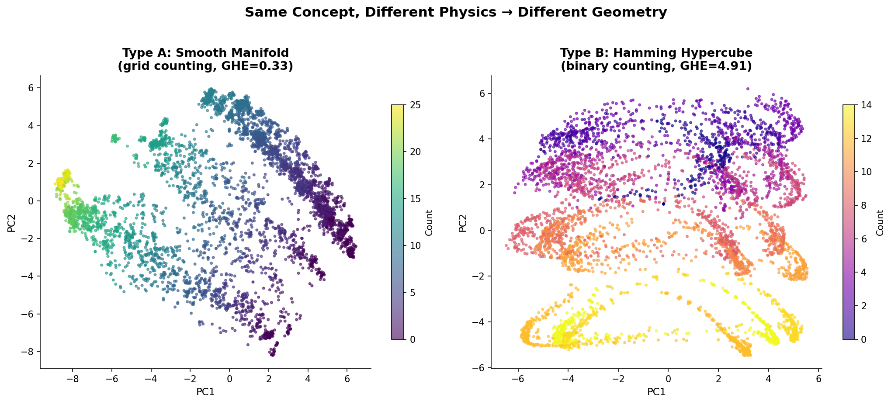
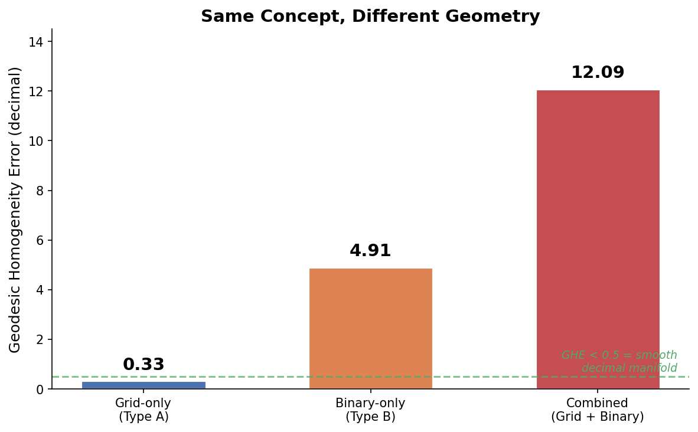
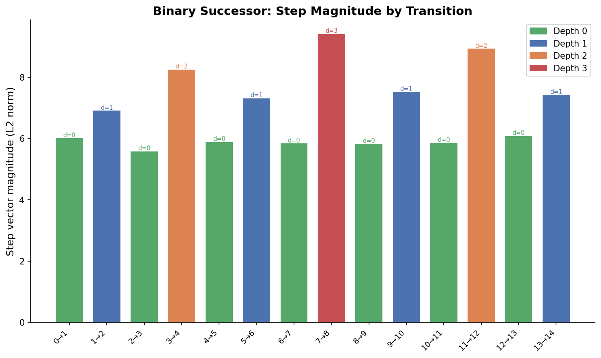
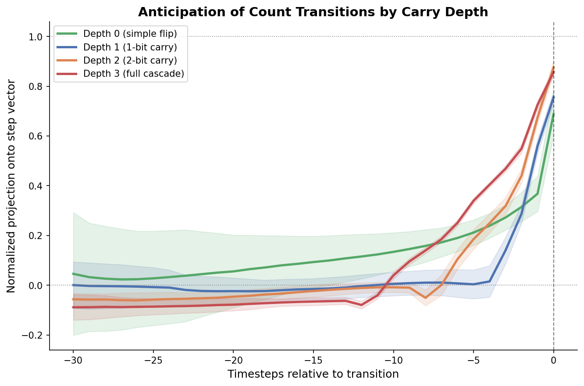
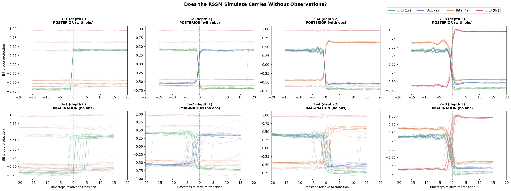
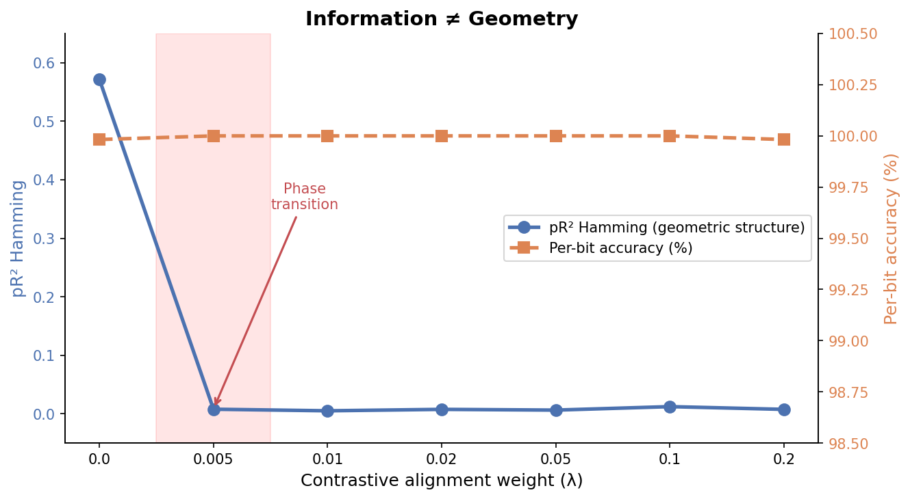
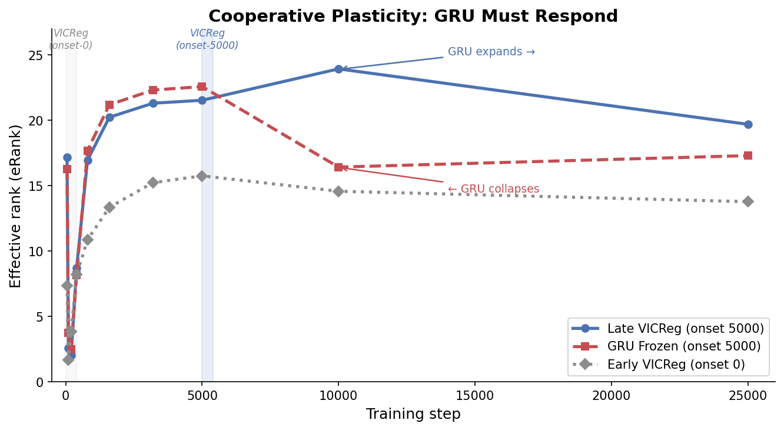

# Anim: When Physics Determines Geometry

**What happens when two different worlds teach the same concept?**

In the [counting manifold paper](README.md) ([repo](https://github.com/major-scale/anim-counting)), we showed that a DreamerV3 world model trained on a simple gathering task develops a geometrically precise number line in its hidden state &mdash; a smooth 1D arc with uniform spacing (GHE=0.33, RSA=0.98).

But what if the counting world used different physics?

We built a second world where counting works through **binary cascading** &mdash; each blob triggers a ripple through a 4-bit register, with carries propagating left to right. The count increases by one, but the physical process is fundamentally different: not a smooth accumulation, but a digital cascade where incrementing 7&rarr;8 requires flipping all four bits simultaneously.

The world model's hidden state reveals a **completely different geometry**. Not a smooth manifold, but a structure organized by **Hamming distance** &mdash; the number of bit-flips between any two counts. Counts that differ by one bit (like 7 and 15, binary 0111 and 1111) are representationally closer than counts that differ by one in value but many bits (like 7 and 8, binary 0111 and 1000).

Same architecture. Same training objective. Same concept. Different physics &rarr; different geometry.

<p align="center">

</p>

We then asked whether a single system could learn *both* geometric structures simultaneously. A simple combined environment fails &mdash; the more complex physics dominates completely. So we designed the **FP Unifier**, an architecture with two frozen specialist world models feeding through learned adapters into a shared integrator. The result: dual geometry, mechanistic insight into how representations integrate, and the finding that **task accuracy and representational geometry are separable** &mdash; a system can retain all knowledge while completely reorganizing how that knowledge is structured.

Along the way, we found that the timing and mechanism of integration reveal dynamics relevant far beyond counting: contrastive alignment actively entangles structures it's meant to integrate, brief late regularization on a consolidated substrate outperforms both early and continuous application (extending the well-cited critical periods framework to modular architectures, where the prediction does not hold), and the integration requires cooperative plasticity between components &mdash; a phenomenon predicted by established mathematics but unnamed in the literature.

---

## The Binary Counting Machine

The binary counting environment presents 15 blobs arranged in a 2D arena. When the bot collects a blob, it triggers a cascade through a 4-column binary display: the ones column fills, then at the carry threshold it empties and the twos column increments, and so on. The observation is a 72-dimensional vector encoding blob positions, column heights, and carry states.

A DreamerV3 RSSM (~12M parameters) builds a 512-dimensional hidden state representation. We evaluate it with the same battery used for the counting manifold, plus metrics designed for Hamming geometry.

### What survives the random baseline

We ran three untrained (random-weight) RSSMs on the identical observation streams &mdash; the same control protocol used in the counting manifold paper. The binary world demands extra caution: its 72-dimensional observation distributes count information across 4 correlated bit columns, making random temporal filtering particularly effective at preserving count signals.

| Metric | Trained | Random (mean&plusmn;sd) | Gap | Verdict |
| :-- | :--: | :--: | :--: | :-- |
| Exact count accuracy | 100.0% | 58.7%&plusmn;1.6% | +41% | **Survives** |
| RSA Hamming &rho; | 0.558 | 0.337&plusmn;0.007 | +0.22 | **Survives** |
| Probe SNR | 6,347 | 45&plusmn;3.4 | 140&times; | **Survives** |
| Probe R&sup2; | 0.9998 | 0.977&plusmn;0.002 | 1.02&times; | Contaminated |
| Per-bit accuracy (all 4) | 100% | 99.0&ndash;100% | &lt;1% | Contaminated |
| RSA ordinal &rho; | 0.466 | 0.502&plusmn;0.085 | &minus;0.04 | Contaminated |

The trained model achieves perfect count identification (100% exact accuracy vs 58.7% random), concentrates count information 140&times; more efficiently (probe SNR), and organizes its representation around Hamming distance rather than ordinal distance. But probe R&sup2; &mdash; the headline metric from the counting paper &mdash; is contaminated here. A random GRU preserves enough of the 4-bit observation structure to achieve R&sup2;=0.977 without any training.

A key surprise: RSA ordinal is also contaminated &mdash; the random RSSM matches or exceeds the trained model (0.502 vs 0.466). The binary observation format inherently preserves ordinal distance patterns through any temporal filter. The trained model's unique learned contribution is specifically Hamming organization (0.558 vs 0.337), not ordinal organization. This sharpens the Type A vs Type B distinction: the binary specialist doesn't just happen to have Hamming geometry &mdash; Hamming geometry is the thing it learned that a random network cannot produce.

This is why the binary evaluation leads with exact accuracy and Hamming RSA, not probe R&sup2;.

Source: `artifacts/battery/binary_random_baseline.json`

### Type A vs Type B

The key comparison with the counting manifold:

| Metric | Grid World (Type A) | Binary World (Type B) |
| :-- | :--: | :--: |
| Decimal GHE | 0.33 (smooth manifold) | 4.91 (not a manifold) |
| Dominant geometry | Ordinal distance | Hamming distance |
| Pairwise R&sup2; Hamming | &mdash; | 0.737 |
| Pairwise R&sup2; Decimal | &mdash; | 0.067 |
| RSA ordinal | 0.978 | 0.466 |
| Topology &beta;<sub>0</sub> | 1 | 1 |
| DCI compactness | &mdash; | 0.121 (distributed) |

Both are single connected components (&beta;<sub>0</sub>=1). Both represent count with high precision. But the internal structure is fundamentally different: the grid world produces a smooth 1D arc where numerical neighbors are representational neighbors; the binary world produces a structure where *bit-flip* neighbors are representational neighbors.

The representation didn't choose one geometry for philosophical reasons. The world model builds internal structure optimized for prediction, and binary cascade physics are best predicted by tracking bit states, not decimal magnitude.

<p align="center">
  
</p>

**Figure 1: Geodesic Homogeneity Error across three world types.** Lower GHE means the representation spacing better matches a smooth decimal number line. The grid world (Type A) produces near-perfect spacing. The binary world (Type B) does not &mdash; its geometry follows Hamming distance, not decimal distance. The combined world is worst of all.

### The binary successor function

In the counting manifold, "+1" is a smooth rotation through 512-dimensional space &mdash; 11 PCA components for 90% variance, uniform step size, continuous arc. What does "+1" look like when the physical mechanism is binary cascading?

We computed step vectors (centroid<sub>n+1</sub> &minus; centroid<sub>n</sub>) for all 14 transitions and found that the model has precisely internalized the cascade mechanism.

**Step magnitude scales with carry depth (r=0.98).**

| Carry depth | Example transitions | Mean magnitude | Std | n |
| :--: | :-- | :--: | :--: | :--: |
| 0 (simple flip) | 0&rarr;1, 2&rarr;3, 4&rarr;5, 6&rarr;7, 8&rarr;9, 10&rarr;11, 12&rarr;13 | 5.86 | 0.15 | 7 |
| 1 (1-bit carry) | 1&rarr;2, 5&rarr;6, 9&rarr;10, 13&rarr;14 | 7.28 | 0.23 | 4 |
| 2 (2-bit carry) | 3&rarr;4, 11&rarr;12 | 8.58 | 0.34 | 2 |
| 3 (full cascade) | 7&rarr;8 | 9.40 | &mdash; | 1 |

Every simple flip looks the same to the model (CV=0.025). Every single-carry looks the same. The representational displacement isn't approximate &mdash; it scales almost perfectly with the number of bits that physically flip.

<p align="center">
  
</p>

**Figure 5: Binary successor step magnitudes.** Each bar is one count transition. Color indicates carry depth. The staircase pattern &mdash; green baseline, blue steps, orange jumps, red peak at 7&rarr;8 &mdash; is the cascade mechanism directly visible in the representation.

**Step vectors decompose linearly into four independent bit-flip directions.**

We trained per-bit linear probes and projected each step vector onto the four probe weight directions:

| Transition | Bit0 (1s) | Bit1 (2s) | Bit2 (4s) | Bit3 (8s) | Expected |
| :-- | :--: | :--: | :--: | :--: | :-- |
| 0&rarr;1 | **+1.506** | &minus;0.002 | &minus;0.001 | &minus;0.001 | +000 |
| 1&rarr;2 | **&minus;1.506** | **+1.498** | +0.000 | &minus;0.001 | &minus;+00 |
| 3&rarr;4 | &minus;1.403 | **&minus;1.437** | **+1.458** | +0.002 | &minus;&minus;+0 |
| 7&rarr;8 | **&minus;1.354** | **&minus;1.363** | **&minus;1.415** | **+1.649** | &minus;&minus;&minus;+ |

Sign agreement: **25/25 (100%)** across all changed bits in all transitions. Cross-talk for unchanged bits: ~0.001. The model has discovered four orthogonal "bit-flip" axes in 512-dimensional space and composes them linearly to represent any transition. It independently invented a coordinate system for binary arithmetic.

**Transitions group by carry type, not by count value.**

The cosine similarity matrix between all 14 step vectors reveals two distinct operational modes:

| Comparison | Mean cosine similarity |
| :-- | :--: |
| Within depth-0 (simple flips) | +0.631 |
| Within depth-1 (1-bit carries) | +0.842 |
| Within depth-2 (2-bit carries) | +0.861 |
| Depth-0 vs depth-1 | **&minus;0.504** |
| Depth-0 vs depth-2 | **&minus;0.471** |

Simple flips and carries point in **nearly opposite directions** in 512-d space. Within-carry transitions cluster tightly. The model doesn't just predict what comes next &mdash; it represents *what kind of computational event* is happening.

**The model anticipates carries from the current bit state.**

We measured how early the hidden state begins shifting toward the next count's representation:

| Carry depth | Anticipation onset | Std |
| :--: | :--: | :--: |
| 0 (simple flip) | 18.3 timesteps | 9.6 |
| 1 (1-bit carry) | 2.8 timesteps | 0.5 |
| 2 (2-bit carry) | 5.5 timesteps | 0.5 |
| 3 (full cascade) | 8.4 timesteps | 0.5 |

Simple flips have the longest, most gradual anticipation &mdash; the model sees the bot approaching and smoothly prepares. Carries are abrupt (std 0.5). But within carries, deeper cascades start earlier: the model looks at the current bit state (0111), recognizes that the next increment will be a full cascade, and begins preparing ~8 timesteps out. It doesn't react to carries &mdash; it predicts them.

<p align="center">
  
</p>

**Figure 6: Anticipation of count transitions.** Normalized projection onto the step vector direction in the 30 timesteps before each transition. Depth-0 (green) shows gradual preparation with high variance. Carries (blue, orange, red) are sharp late jumps, but deeper cascades begin preparing earlier.

**Comparison with the grid specialist:**

| Property | Grid specialist | Binary specialist |
| :-- | :--: | :--: |
| PCA components for 90% | 11 | **5** |
| Step magnitude CV | 0.21 | **0.18** |
| Max/min magnitude ratio | ~1.5&times; | **1.69&times;** |
| Factoring structure | Smooth rotation | **4-bit linear decomposition** |
| Anticipation pattern | Proportional to distance | **Carry-depth dependent** |

The binary successor is structurally simpler (5 vs 11 components) because it decomposes into exactly 4 orthogonal bit-flip directions plus a shared magnitude axis. The grid successor needs 11 components because it's a smooth rotation through high-dimensional space with no discrete decomposition. Both arise from pure next-state prediction.

### The (7,8) residual

One detail connects the successor analysis to the global geometry. Hamming distance predicts that 7 (0111) and 8 (1000) should be maximally distant &mdash; they differ in all 4 bits. And they are far apart. But they're slightly closer than pure Hamming geometry predicts, because they're temporally adjacent &mdash; the model sees 7 transition to 8 every single episode. Two organizing principles coexist: Hamming geometry dominates, but temporal adjacency exerts a secondary pull. The anticipation analysis confirms this &mdash; the model starts preparing for the 7&rarr;8 cascade 8 timesteps in advance, creating a representational trajectory that brings the two states slightly closer than their Hamming distance would predict.

Source: `artifacts/binary_successor/successor_analysis.json`

### Imagination rollout: observation-guided tracking with learned compositional structure

The successor analysis shows the model has clean factored bit structure and anticipates carries. The carry propagation analysis showed sequential tracking of physical cascades &mdash; bit probes trained on *actual column states* detect each bit flip as it happens in the observation, with crossing times spanning ~10 timesteps for full cascades (bit0 at t=&minus;10.4, bit1 at t=&minus;6.4, bit2 at t=&minus;2.5, bit3 at t=&minus;0.5 for 7&rarr;8). But does the model *generate* these cascades internally, or does it track them through observation-driven updates?

We tested this by forking the RSSM into imagination mode (prior only, no observations) 20 timesteps before each carry cascade and measuring whether bit probes show sequential LSB&rarr;MSB cascades in the model's autonomous dynamics.

<p align="center">
  
</p>

**Figure 7: Imagination (bottom) vs posterior (top) bit-probe trajectories.** Each column is one carry depth (0&rarr;1, 1&rarr;2, 3&rarr;4, 7&rarr;8). Thin lines are individual episodes; thick lines are means. The imagination gets the right endpoint but with noise, spread, and ordering violations that increase with carry depth.

**Methodological note**: The probes here are trained on `decimal_count`-derived bit labels, which only update *after* the full cascade completes. This differs from the carry propagation analysis, which trained probes on *actual column states* that change step-by-step during cascades. The two probe types measure different things: decimal-count probes detect transitions between completed count states; column-state probes detect physical bit flips as they happen. The posterior timing in the table below (all bits crossing within 1 step) reflects the decimal-count probe calibration and should not be compared directly to the carry propagation's sequential crossing times. The carry propagation result &mdash; sequential tracking over ~10 steps &mdash; stands.

Three observations from the imagination analysis:

**Imagination predicts endpoints, not processes.** The imagination correctly identifies which bits should flip and in which direction (100% directional agreement at all depths), but the transitions are noisy, spread over ~10 timesteps, and lack consistent sequential ordering. At depth 3 (7&rarr;8), the imagination is classified as non-sequential (bit ordering violated, span = &minus;0.7).

**Carry isolation degrades in imagination.** In the posterior, non-changing bits barely move (max displacement &le; 0.049). In imagination, non-changing bits show significant bleed (max displacement up to 0.163 at depth 1). The model's internal dynamics leak activation across bit dimensions when running without observational correction.

**Noise scales with carry depth.** Depth-0 transitions (single bit flip) are relatively clean in imagination. Depth-3 transitions (all 4 bits) show large variance bands and timing violations. The more bits that must change, the worse the imagination's fidelity.

| Carry depth | Transition | Imagination span | Imag sequential? | Carry bleed (imag) |
| :--: | :--: | :--: | :--: | :--: |
| 0 | 0&rarr;1 | 0.0 | Yes | 0.096 |
| 1 | 1&rarr;2 | 0.3 | Yes | 0.163 |
| 2 | 3&rarr;4 | 0.8 | Yes | 0.123 |
| 3 | 7&rarr;8 | &minus;0.7 | **No** | 0.000 |

Combining the carry propagation analysis (sequential observation-driven tracking) with the imagination rollout (noisy endpoint prediction without observations): the model has all the structural ingredients for binary arithmetic (factored bit axes, carry-depth magnitude scaling, anticipation from current bit state) and uses them with compositional precision when observations guide the process. Without observations, it reaches approximately the right destination but loses the temporal structure of the cascade.

This is **observation-guided forward tracking with learned compositional structure** &mdash; not reactive tracking (the model anticipates carries before they happen) and not autonomous simulation (the model can't reproduce the cascade without visual input). The carry propagation's zero bleed is still remarkable: the model never activates non-participating bits even while tracking cascades in real time. But this precision is scope-bounded tracking, not scope-bounded generation.

This connects to the prediction-without-abstraction finding from Stage 3 (boundary sort): the world model builds representational structure that *encodes* computational operations without *performing* them autonomously. The binary specialist has internalized the structure of addition (four independent bit-flip axes composed to represent any transition) but doesn't execute addition as an internal algorithm. It's a map of arithmetic, not an arithmetic engine.

Source: `artifacts/binary_successor/imagination_rollout.json`

### The first key insight

The same concept &mdash; the number seven &mdash; produces a fundamentally different representational geometry depending on how it's physically implemented. In the gathering grid, seven is a position on a smooth curve. In the binary machine, seven is a vertex on a hypercube. Both are correct. Both are complete. Neither is "the" representation of seven.

This tells us something about what number is: it's not a single geometry. It's whatever is common across all the geometries that different physical implementations produce. To find that commonality, you need to integrate across implementations.

---

## Binary Dominates Combined

What happens when both worlds are present simultaneously? We trained an RSSM on a combined environment with both a grid display (5 columns) and a binary display (4 columns), yielding a 148-dimensional observation.

| Configuration | Decimal GHE | Count Exact | Hamming RSA | Interpretation |
| :-- | :--: | :--: | :--: | :-- |
| Grid-only | 0.33 | 95.6% | &mdash; | Type A: smooth number line |
| Binary-only | 4.91 | 100% | 0.558 | Type B: Hamming hypercube |
| Combined (grid + binary) | **12.1** | 99.6% | 0.736 | **Binary dominates completely** |

The combined model's GHE is *worse* than binary alone. The grid signal &mdash; which produces the most geometrically precise representation in isolation &mdash; exerts zero geometric pressure when binary physics are also present. The more complex physical process (cascade) completely dominates representation geometry.

Yet the combined model achieves near-perfect count accuracy (99.6% exact vs 24.2% random), and the two observation formats share a common subspace: cross-format transfer achieves R&sup2;=0.999 in both directions (grid&rarr;count and count&rarr;grid), with 17 of 20 principal dimensions shared (Jaccard overlap = 0.739). The model knows the same count in both formats. It just organizes its representation around the format that's harder to predict.

**Prediction complexity determines representation geometry.** The grid display is spatially redundant &mdash; each new blob fills a predictable slot. The binary display involves carries, state changes across columns, and non-local dependencies. The world model allocates geometric structure to whatever is hardest to predict, even when simpler dynamics carry the same information.

---

## The Synthesis Problem

The combined result creates a problem. If you want a representation that preserves *both* geometric structures &mdash; the ordinal distance of the grid world and the Hamming distance of the binary world &mdash; you can't just train on both simultaneously. The more complex physics wins.

A separate experiment reinforces this pattern: an RSSM watching a passive sorting task (deterministic bot sorts red blobs left, blue blobs right &mdash; zero action, zero reward from the observer) achieved 93% exact count accuracy on held-out episodes (vs 26% random, 14% raw observation). But its GHE was 1.192 &mdash; poor by the counting manifold's standards.

The question becomes: can we build an architecture that maintains both geometric structures simultaneously?

---

## The FP Unifier

### Architecture

The Functional Pipeline (FP) Unifier separates specialist knowledge from integrated representation:

```
┌──────────────┐     ┌──────────────┐
│  Grid RSSM   │     │ Binary RSSM  │
│  (frozen)    │     │  (frozen)    │
│  h_A: 512d   │     │  h_B: 512d   │
└──────┬───────┘     └──────┬───────┘
       │                    │
    ┌──┴──┐              ┌──┴──┐
    │ f_A │ ×α_A         │ f_B │ ×α_B
    │ MLP │              │ MLP │
    └──┬──┘              └──┬──┘
       │                    │
       └────────┬───────────┘
                │ concat
         ┌──────┴──────┐
         │  GRU(256)   │
         │ + stoch 32² │
         └──────┬──────┘
                │
         ┌──────┴──────┐
         │   Decoders  │
         │ (both obs)  │
         └─────────────┘
```

Two pre-trained specialist RSSMs (grid and binary) are frozen. Their hidden states feed through learned adapter networks (2-layer MLPs, 512&rarr;128, SiLU activation) with learned scalar gates (&alpha;<sub>A</sub>, &alpha;<sub>B</sub>, initialized at 0.01) into a shared GRU(256) with 32&times;32 categorical stochastic state. The integrator must reconstruct *both* observation streams from its unified representation. ~600K trainable parameters.

The architecture borrows from established multi-modal fusion patterns &mdash; frozen encoders, learned adapters, lightweight fusion module. The pattern appears in Flamingo, ImageBind, LLaVA, and the broader LoRA/adapter literature. What's different is not the architecture but what the specialists *are* (world models with embodied experience, not feature extractors) and what the unifier is asked to *do* (integrate different physical implementations of the same abstract concept, not combine different sensory modalities of the same physical event).

### Base Results (&lambda;=0.1 contrastive alignment)

| Metric | Value | Context |
| :-- | :--: | :-- |
| Count probe R&sup2; | 0.988 | vs 0.031 untrained |
| Count exact accuracy | 76.9% | |
| Per-bit accuracy | 100% (all 4) | All binary knowledge preserved |
| RSA ordinal &rho; | 0.410 | **Both geometries** |
| RSA Hamming &rho; | 0.265 | **simultaneously present** |
| GHE | 1.72 | Between Type A and Type B |
| &alpha;<sub>A</sub> (grid adapter) | 1.65 | Both adapters active |
| &alpha;<sub>B</sub> (binary adapter) | 1.71 | 4% gap &mdash; balanced |
| CKA asymmetry | 0.050 | Moderate balance |
| DCI informativeness | 0.984 | High |
| DCI compactness | 0.062 | **Distributed** |
| Topology &beta;<sub>0</sub> | 1 | Single manifold |

The integrator preserves both ordinal and Hamming structure &mdash; not perfectly, but simultaneously. This contrasts with the combined RSSM, which preserved only Hamming structure.

Source: `artifacts/sweep_results/results.json` (&lambda;=0.1 condition)

### Causal Validation

Does the integrator *use* this dual representation, or does it merely contain it?

We performed interchange intervention analysis (IIA): surgically swapping count-related activation subspaces between samples and measuring whether the model's predictions change accordingly.

**Methodological note**: The original analysis reported 100% IIA on a 1D subspace. This was **retracted** &mdash; the threshold was too lenient, and untrained models also scored 100%. The corrected analysis uses **directional IIA** (cosine similarity between reconstruction change and expected direction &gt; 0.5) with a null control (untrained model scores ~0%).

| PCA dimensions (k) | Directional IIA | Nearest centroid |
| :--: | :--: | :--: |
| 1 | 17.5% | 4.7% |
| 2 | 35.2% | 9.8% |
| 4 | 52.9% | 14.9% |
| **8** | **84.2%** | **24.7%** |

Count is causally active in the representation, but distributed across 8+ dimensions (DCI compactness = 0.062). This is consistent with DreamerV3's architecture: a 256-dimensional GRU with 32&times;32 categorical stochastic state has ample capacity but no incentive to concentrate count into a single dimension.

Source: `artifacts/checkpoints/unifier_s0/validation_corrected.npz`

---

## What Controls Integration?

We ran a systematic ablation suite to understand the mechanism of dual-geometry integration. Four experiments, each revealing a different aspect of how representations integrate.

### 1. Accuracy &ne; Geometry (Contrastive Weight Sweep)

We trained the unifier at 7 contrastive alignment weights (&lambda; = 0, 0.005, 0.01, 0.02, 0.05, 0.1, 0.2):

| &lambda; | CKA asym | pR&sup2; Hamming | Per-bit acc | Count exact | RSA ordinal |
| :--: | :--: | :--: | :--: | :--: | :--: |
| 0.0 | 0.213 | **0.572** | 100% | 99.6% | 0.684 |
| **0.005** | **0.001** | 0.008 | 100% | 87.7% | 0.443 |
| **0.01** | 0.033 | 0.005 | 100% | 90.5% | 0.487 |
| 0.02 | 0.060 | 0.008 | 100% | 80.9% | 0.448 |
| 0.05 | 0.010 | 0.006 | 100% | 80.7% | 0.445 |
| 0.1 | 0.050 | 0.012 | 100% | 76.9% | 0.410 |
| 0.2 | 0.035 | 0.007 | 99.9% | 80.0% | 0.429 |

<p align="center">
  
</p>

**Figure 2: The accuracy-geometry dissociation.** As contrastive alignment (&lambda;) increases from zero, Hamming geometric structure (blue, pR&sup2;) collapses abruptly at &lambda;=0.005. But per-bit decoding accuracy (orange) stays at 100% across the entire range. The model retains all binary knowledge while completely reorganizing how that knowledge is geometrically arranged.

The phase transition at &lambda;=0.005 is the key finding. At &lambda;=0 (no alignment), Hamming geometry is faithfully preserved (pR&sup2;=0.572) &mdash; the binary specialist's structure passes through. At &lambda;=0.005, Hamming geometric structure collapses to pR&sup2;=0.008 &mdash; but **per-bit accuracy stays at 100%**. The model retains all four binary bits as decodable information while completely reorganizing the geometric relationship between count states.

**Accuracy is retained. Geometry is changed.** The contrastive loss doesn't erase knowledge &mdash; it changes the organizational principle. This dissociation held across every subsequent experiment: per-bit accuracy at 100% regardless of contrastive weight, VICReg timing, adapter configuration, or GRU freezing. Task accuracy and geometric organization are formally independent &mdash; the most consistent finding across conditions.

The general principle that task accuracy and representational geometry are separable has precedent in neuroscience &mdash; Fascianelli et al. (*Nature Communications*, 2024) demonstrated that two monkeys performing the same task at the same accuracy level exhibited strikingly different representational geometries in prefrontal cortex. Our contribution is a controlled demonstration in a computational system where the geometric structure can be systematically manipulated through training interventions, revealing the specific mechanisms (contrastive entanglement, VICReg dimensional expansion) that determine which geometry emerges.

Source: `artifacts/sweep_results/results.json`

### 2. VICReg Reveals the Mechanism

Contrastive alignment forces ordinal structure through explicit distance matching. We replaced it with VICReg's variance term &mdash; a gentler pressure that only requires representational dimensions to have non-zero variance, without specifying any target geometry.

Training protocol: VICReg variance loss (var_weight=0.5) active during steps 0&ndash;400 only, then removed. The loss reaches L<sub>var</sub>=0.000 by step 400 (trivially satisfied).

| Metric | VICReg (400 steps) | Best contrastive (&lambda;=0.005) | No alignment (&lambda;=0) |
| :-- | :--: | :--: | :--: |
| RSA ordinal | **0.833** | 0.443 | 0.684 |
| RSA Hamming | **0.437** | 0.234 | 0.477 |
| pR&sup2; Hamming | 0.261 | 0.008 | **0.572** |
| Count exact | **99.8%** | 87.7% | 99.6% |
| CKA asymmetry | 0.013 | **0.001** | 0.213 |
| Per-bit accuracy | 100% | 100% | 100% |

400 steps of variance pressure &mdash; less than 1% of training &mdash; permanently changed the final geometry. RSA values are 2&times; higher for both ordinal *and* Hamming compared to the best contrastive condition, and count accuracy is 12 percentage points better.

What happened? VICReg forces dimensional expansion during a brief early window, and the resulting geometric structure persists long after the loss term goes to zero. The mechanism is not alignment (VICReg specifies no target geometry) but **dimensional diversity** &mdash; preventing the representation from collapsing into a low-dimensional subspace during the critical early period of adapter learning.

Source: `artifacts/checkpoints/unifier_vicreg_s0/eval_results.json`

### 3. Late Imprinting Dominates

If the VICReg window acts as an imprinting period, when does it matter most? The well-cited critical learning periods literature (Achille et al., ICLR 2019; Golatkar et al., NeurIPS 2019) predicts that early training is uniquely formative. Golatkar et al. specifically showed that applying regularization only after the initial transient produces a generalization gap as large as if regularization were never applied.

We tested onset timing: VICReg active at steps 0&ndash;400 (early) vs steps 5000&ndash;5400 (late), keeping everything else identical.

| Onset | RSA ord | RSA ham | pR&sup2; ham | CKA asym | Exact | eRank | &alpha;<sub>A</sub> | &alpha;<sub>B</sub> |
| :-- | :--: | :--: | :--: | :--: | :--: | :--: | :--: | :--: |
| Step 0 | 0.812 | 0.405 | 0.203 | 0.041 | 99.8% | 6.8 | 0.14 | 0.14 |
| **Step 5000** | **0.845** | **0.552** | **0.569** | **0.030** | **100%** | **9.1** | **0.21** | **0.21** |

Late VICReg wins on *every metric*. This result extends the critical periods framework to modular architectures, where the prediction does not hold.

The explanation involves the GRU's learning dynamics. By step 5000, the GRU's update gates have dropped from 0.491 to approximately 0.05 &mdash; the GRU is barely updating its hidden state. It has consolidated into a slow temporal integrator. When VICReg fires on this consolidated substrate, the pressure can't reshape the GRU (it's effectively frozen), so it routes entirely through the adapters. The adapters grow larger (&alpha;&asymp;0.21 vs 0.14 for early VICReg), giving specialist information more geometric influence over the unified representation.

Early VICReg, by contrast, fires while the GRU is still plastic. The GRU absorbs the variance pressure, the adapters stay small, and you get a compromise &mdash; decent temporal dynamics, decent geometry, but neither is optimal. Worse, the early VICReg boost is transient: Hamming metrics peak at step 3200 then decay through the rest of training.

Why doesn't Golatkar et al.'s prediction hold here? Three reasons, each independently sufficient. First, the architecture has **differential plasticity** &mdash; the GRU and adapters have very different effective learning rates by step 5000, unlike the homogeneous networks Golatkar tested. Second, VICReg is a **geometric regularizer** operating on representational structure, not a parameter-level regularizer like weight decay. Third, the **modular architecture** creates spatially separated consolidation and adaptation &mdash; the components that consolidated (GRU) are different from the ones being adapted (adapters). Golatkar's result holds for homogeneous feedforward networks with parameter-level regularizers. This architecture is none of those things, which is why it extends the critical periods framework rather than contradicting it.

This finding is directly relevant to multi-modal fusion: instead of continuously applying alignment pressure (which degrades geometry, as the contrastive sweep showed), brief late alignment on a consolidated backbone produces superior outcomes. HASTE (NeurIPS 2025 poster) demonstrated that early-then-stop *representation alignment* (knowledge distillation from a frozen teacher) outperforms continuous alignment in diffusion models. Our result goes further: late-onset outperforms early-onset, a claim not made by any prior work we have found.

Replication: we reran both conditions on a separate GPU. Direction preserved &mdash; onset-5000 still wins on all key metrics (RSA ordinal 0.772 vs 0.801, RSA Hamming 0.539 vs 0.432). Magnitudes shift between runs, motivating multi-seed validation as future work.

Source: `artifacts/imprinting_results.json`, `artifacts/checkpoints/imprinting_rerun_results.json`

### 4. The Cooperative Mechanism (GRU Freeze Test)

The GRU's gates are at 0.05 by step 5000 &mdash; barely updating. The natural hypothesis: the GRU is effectively frozen anyway, and late VICReg works entirely through the adapters. We tested this by explicitly freezing all GRU parameters at step 5000, then applying the same VICReg pulse.

<p align="center">
  
</p>

**Figure 3: Effective rank trajectories reveal cooperative dynamics.** The unfrozen model (blue) expands dimensionality after VICReg at step 5000 and sustains it. The frozen model (red) starts from the same point but collapses &mdash; the opposite trajectory. The early-onset model (gray) peaks lower and decays. The VICReg window (5000&ndash;5400) is shaded.

| Step | Unfrozen eRank | Frozen eRank |
| :--: | :--: | :--: |
| 5,000 (VICReg starts) | 21.5 | 22.6 |
| 10,000 (post-VICReg) | **23.9** &uarr; | **16.4** &darr; |
| 25,000 (final) | 19.7 | 17.3 |

Opposite trajectories. Under identical VICReg pressure, the unfrozen GRU *expands* its representational dimensionality while the frozen GRU *collapses*. The adapters alone cannot maintain dimensional expansion.

| Metric @ step 25K | Unfrozen | Frozen | Difference |
| :-- | :--: | :--: | :-- |
| RSA Hamming | 0.535 | 0.477 | Hamming suffers most |
| RSA ordinal | 0.782 | 0.797 | Ordinal unaffected |
| pR&sup2; Hamming | 0.553 | 0.527 | Modest reduction |
| eRank (final) | 19.7 | 17.3 | 12% lower |

Hamming geometry &mdash; the fragile one, the structure that conflicts with the dynamics loss's ordinal preference &mdash; is what suffers when the GRU can't accommodate. Ordinal structure is unaffected because it aligns with the dynamics loss naturally.

The mechanism is cooperative: adapters propose geometric structure through their weights, and the GRU's residual plasticity (~5% gate updates) integrates that signal into a coherent high-dimensional code. Freeze the GRU and it becomes a one-way broadcast &mdash; adapters talk, but the dynamics can't respond.

**The theoretical explanation is surprisingly deep.** In continuous-rate recurrent neural networks, the rank of structured connectivity constrains the dimensionality of emergent dynamics (Mastrogiuseppe and Ostojic, *Neuron*, 2018). While their analysis applies to sigmoidal networks rather than gated architectures like GRUs, the principle is analogous: a frozen recurrent network's fixed weights impose a ceiling on representational dimensionality that new inputs cannot breach. VICReg-boosted adapters push stronger, more varied signals into the frozen GRU, but stronger inputs paradoxically *compress* dynamics further by driving neurons into saturation (Rajan, Abbott, and Sompolinsky, *Physical Review E*, 2010; Engelken, Wolf, and Abbott, *Physical Review Research*, 2023). The unfrozen GRU escapes this trap because its weight updates can expand the effective connectivity rank, lifting the dimensionality ceiling.

Two-timescale stochastic approximation theory (Borkar, 1997) provides the formal framework: when two coupled processes update at different rates, the analysis proceeds by treating the slow process as quasi-static from the fast process's perspective. The critical insight is that the limit where the slow process's learning rate *approaches* zero (maintaining two-timescale coupling) is qualitatively different from setting it to *exactly* zero (collapsing to single-timescale dynamics). This is a degenerate case in the sense of singular perturbation theory &mdash; the &epsilon;&rarr;0 limit of a two-timescale system is not equivalent to the &epsilon;=0 system. Our observation &mdash; that a GRU with 5% gate updates behaves qualitatively differently from a fully frozen GRU &mdash; is consistent with this discontinuity.

We call this phenomenon **cooperative residual plasticity**. An extensive literature search confirmed that it has not been previously named or unified as a concept, despite being independently predicted by attractor dynamics theory, two-timescale optimization, and observed in at least five biological systems (Benna-Fusi synaptic cascades, sleep consolidation, complementary learning systems, synaptic tagging, neuromodulatory gating). MIST (2025) independently found that updating fewer than 0.5% of backbone parameters improves adapter learning across benchmarks &mdash; consistent with our finding but without the theoretical framework. SLCA (Zhang et al., ICCV 2023) demonstrated the core empirical observation in continual learning: slow backbone learning rates dramatically outperform frozen backbones, with improvements up to 50 percentage points on standard benchmarks. Our contribution beyond SLCA is threefold: the theoretical framing connecting the observation to two-timescale optimization and attractor dynamics, the biological grounding across five independent systems, and the specific demonstration in a modular world-model architecture where the effect manifests as representational dimensionality collapse.

This has potential implications for parameter-efficient fine-tuning, where the standard practice is fully frozen backbones. Our result is consistent with a discontinuity at exactly zero backbone learning rate. Whether the effect scales to large transformers on standard benchmarks remains an open question &mdash; we demonstrate it in one architecture at one scale.

Source: `scripts/subspace_results/erank_trajectory.json`

---

## The Subspace Analysis

How does the integrator maintain two geometric structures in the same representation? We analyzed the ordinal and Hamming subspaces across 7 experimental conditions, measuring whether the same hidden-state dimensions contribute to both structures, and tested the results against a null model (random vectors in 256-d space, 10,000 permutations).

| Condition | Dim correlation | z-score | p-value | Interpretation |
| :-- | :--: | :--: | :--: | :-- |
| Baseline (&lambda;=0.1) | 0.090 | 1.45 | 0.126 | Null &mdash; not correlated |
| VICReg | 0.028 | 0.46 | 0.668 | **Null** |
| No alignment (&lambda;=0) | 0.124 | 2.01 | 0.040 | Marginal |
| Contrastive &lambda;=0.005 | 0.182 | 2.93 | 0.009 | Above null |
| Contrastive &lambda;=0.05 | **0.307** | **4.90** | **0.0003** | **Actively entangles** |
| N400 onset-0 | 0.077 | 1.25 | 0.209 | Null |
| Onset-5000 | 0.053 | 0.82 | 0.402 | **Null** |

Two findings emerge:

**Dimensional decorrelation is free.** In VICReg and late-onset conditions, the ordinal and Hamming subspaces use different dimensions &mdash; but this is not learned. In 256-dimensional space, the expected absolute cosine similarity between two random unit vectors is approximately 0.050 with standard deviation 0.063. Any high-dimensional distributed representation looks decorrelated by chance. The null model confirms these correlations are statistically indistinguishable from random.

**Contrastive alignment actively entangles.** At &lambda;=0.05, the ordinal and Hamming subspaces are *more correlated* than random (z=4.9, p=0.0003). The contrastive loss forces both structures into overlapping dimensions, which explains why Hamming geometry collapses under contrastive pressure &mdash; the two structures compete for the same representational resources. This is the mechanistic explanation for the phase transition at &lambda;=0.005: even tiny contrastive pressure begins entangling the two geometric structures, and entanglement destroys whichever structure is weaker (Hamming, because it conflicts with the dynamics loss's preference for ordinal organization).

VICReg's actual contribution is not decorrelation (which comes for free) but **effective rank expansion** &mdash; increasing the number of dimensions the representation actively uses, giving both geometric structures room to coexist.

Source: `scripts/subspace_results/null_model_results.json`

### 5. Compositional Structure Survives Unification

Does the binary specialist's clean factored bit structure survive the adapter + GRU integration? We ran the binary successor decomposition on all 7 unifier conditions using the same canonical inputs (h_a, h_b from battery_final.npz), comparing against the raw binary specialist.

| Condition | mag-depth r | Sign agr. | Cross-talk | cos(d0,d0) | cos(d0,d1) | PCA-90 |
| :-- | :--: | :--: | :--: | :--: | :--: | :--: |
| Binary specialist (512-d) | +0.975 | 23/23 | 0.001 | 0.627 | &minus;0.507 | 5 |
| &lambda;=0.1 (base) | +0.012 | 23/23 | 0.010 | 0.174 | &minus;0.225 | 7 |
| &lambda;=0.005 (sweet spot) | &minus;0.044 | 23/23 | 0.010 | 0.189 | &minus;0.219 | 8 |
| &lambda;=0.05 | &minus;0.043 | 23/23 | 0.010 | 0.234 | &minus;0.267 | 7 |
| &lambda;=0.0 (no alignment) | +0.962 | 23/23 | 0.011 | 0.658 | &minus;0.515 | 5 |
| VICReg (70K) | +0.903 | 23/23 | 0.012 | 0.522 | &minus;0.372 | 6 |
| Late VICReg (onset 5000) | +0.953 | 23/23 | 0.011 | 0.600 | &minus;0.462 | 6 |
| Early VICReg (onset 0) | +0.817 | 23/23 | 0.011 | 0.580 | &minus;0.403 | 6 |

Three findings:

**Sign agreement is universally preserved.** Every condition achieves 100% sign agreement (23/23 changed bits match expected direction). The 4 orthogonal bit-flip axes discovered by the specialist survive the adapter + GRU transform intact. This holds regardless of alignment loss, VICReg timing, or contrastive weight.

**Carry-depth structure splits on contrastive pressure.** Without contrastive alignment (&lambda;=0, VICReg variants), magnitude-depth correlation stays high (r=0.82&ndash;0.96), meaning the 7&rarr;8 full cascade is still representationally larger than a simple 0&rarr;1 flip. With contrastive alignment, this correlation drops to essentially zero (r&asymp;0). The InfoNCE loss normalizes all count-to-count distances equally, erasing the carry-depth signature.

**Cosine structure tracks magnitude-depth.** Non-contrastive conditions preserve the specialist's cosine grouping (within-depth-0 similarity ~0.58&ndash;0.66, depth-0 vs depth-1 ~&minus;0.40 to &minus;0.51). Contrastive conditions flatten this structure (within-depth-0 drops to ~0.17&ndash;0.23, between-group similarity weakens). The geometric grouping by carry type survives integration only when contrastive pressure is absent.

This is the accuracy-geometry dissociation at the individual-transition level: the contrastive loss preserves what the step vector *means* (which bits flip) while erasing what it *looks like* (how far the representation moves).

Source: `artifacts/binary_successor/unifier_successor_analysis.json`

---

## What the Unifier Learned

Across every experiment, every alignment condition, every VICReg timing, every architectural intervention, four findings never wavered:

1. **Per-bit accuracy stays at 100%.** The unifier always knows the count, in both formats, regardless of how it organizes that knowledge geometrically.

2. **The unifier genuinely integrates.** CKA asymmetry as low as 0.013 means it draws from both specialists nearly equally &mdash; not collapsing to whichever is easier.

3. **Task accuracy and geometric organization are independent.** You can reshape the geometry dramatically (ordinal-dominant, Hamming-dominant, balanced) and task accuracy doesn't change. Content and structure are formally separable.

4. **Factored compositional structure survives integration.** We ran the binary successor decomposition on unifier hidden states (256-dim) across all 7 conditions. Sign agreement &mdash; whether each step vector projects correctly onto the 4 independent bit-flip directions &mdash; is **100% (23/23) in every condition**, matching the specialist. The adapters faithfully relay the factored bit structure through the GRU. Cross-talk increases ~7&times; (0.001&rarr;0.010) but remains negligible in absolute terms.

    But magnitude-depth correlation &mdash; whether the representational displacement from n to n+1 scales with carry depth &mdash; splits cleanly along the contrastive/non-contrastive divide:

    | Group | Conditions | mag-depth r |
    | :-- | :-- | :--: |
    | Non-contrastive | &lambda;=0, VICReg, onset-5000, onset-0 | +0.82 to +0.96 |
    | Contrastive | &lambda;=0.005, &lambda;=0.05, &lambda;=0.1 | &minus;0.04 to +0.01 |

    The contrastive InfoNCE loss treats all count mismatches equally (same-count positive, different-count negative), normalizing representational distances regardless of carry depth. This erases the magnitude-depth structure while perfectly preserving the factored bit directions &mdash; the accuracy-geometry dissociation visible at the level of individual transitions.

5. **The integration is controllable and stable.** VICReg timing, contrastive weight, and architectural choices provide precise control over the resulting geometry. The unifier isn't a black box &mdash; its representational structure responds predictably to training interventions.

### Integration, not yet abstraction

What the unifier has now is integration &mdash; two specialist geometries coexisting in a shared space. What it doesn't yet have is abstraction. The unifier's representation of "seven" is a point that satisfies both ordinal and Hamming distance relationships simultaneously. But it can't generalize to a third encoding of seven without retraining. True abstraction &mdash; a format-independent concept of seven-ness &mdash; would likely require many more specialists encoding genuinely different mathematical properties (comparison, modular arithmetic, primality, addition), forcing the unifier to find what's invariant across all of them rather than just holding two encodings simultaneously.

With two specialists, the unifier can get away with co-encoding. With five or ten, it can't &mdash; there isn't enough representational capacity to maintain separate encodings of every specialist's geometry. The unifier would be forced to find the shared structure, the invariant across formats. At that point, what emerges in the unifier's representation *is* the abstract concept.

That's future work. But the architecture supports it. Each new specialist is a self-contained training run. Each new unifier is a lightweight integration experiment. The infrastructure scales naturally toward the question the project was designed to ask: does mathematical cognition emerge from embodied experience?

### Random baseline methodology

Every metric in this write-up has been tested against untrained random-weight RSSMs (3 seeds) run on identical observation streams. Metrics marked "contaminated" are reported but not used as evidence of learning. Only metrics with clear trained/random separation are treated as meaningful:

- Exact count accuracy (100% vs 58.7%)
- RSA Hamming &rho; (0.558 vs 0.337)
- Probe SNR (6,347 vs 45)

The counting manifold paper's probe R&sup2;=0.993 vs 0.120 untrained is valid because the grid world concentrates count in 2 of 82 observation dimensions &mdash; the model must extract it. The binary world distributes count across 72 correlated dimensions &mdash; a random GRU preserves it through temporal filtering alone. The distinction matters, and we test for it in every experiment.

---

## Limitations

**Scale.** Everything here is 15 count states in a 256-dim unifier with 600K parameters. The 32-state scaling test &mdash; retraining both specialists on 0&ndash;31 and retraining the unifier &mdash; has not been run. Whether the findings generalize to larger state spaces is an open question.

**Replication is limited.** The imprinting sweep results replicate directionally (onset-5000 wins) but magnitudes shift between runs (RSA ordinal 0.845&rarr;0.772). The contrastive weight sweep, VICReg ablation, and GRU freeze test are single seeds.

**No causal interventions for the unifier ablations.** The directional IIA (84.2% on 8D) provides partial causal evidence for the base unifier. The ablation experiments (contrastive sweep, VICReg timing, GRU freeze) rely on correlational metrics. Interchange interventions on the ablation conditions would strengthen the mechanistic claims.

**No rollout divergence for the unifier.** The counting and classification experiments included rollout divergence (multi-step prediction gap between trained and random), our strongest probe-free metric. The unifier evaluation does not yet include this test.

**Imagination rollout probe calibration differs from carry propagation.** The imagination rollout trains probes on `decimal_count`-derived labels, which stay constant during cascades and only update at completion. The carry propagation analysis trains probes on actual column states, which change step-by-step. The two probe types cannot be directly compared for timing measurements. To properly test whether imagination reproduces sequential cascade dynamics, the imagination rollout would need to use column-state-calibrated probes &mdash; this remains future work.

**Architecture-specific mechanism.** The cooperative GRU-adapter mechanism is specific to this architecture. Two-timescale stochastic approximation theory predicts the discontinuity at zero backbone learning rate is consistent with a degenerate case generic to coupled systems, but whether the specific effects (eRank expansion, Hamming preservation, late-onset advantage) transfer to transformers, SSMs, or other architectures is unknown.

**Transformer generalization for cooperative residual plasticity.** The entire LoRA/adapter ecosystem assumes frozen backbones work fine. Our result is consistent with a discontinuity at exactly zero backbone learning rate. Whether this matters for large transformer fine-tuning on standard benchmarks &mdash; where the pretrained backbone's attractor manifold may already be well-aligned with fine-tuning distributions &mdash; is an open question. The effect may be specific to settings where the frozen component's attractor structure becomes misaligned with new objectives.

**Binary probe R&sup2; is contaminated.** Our binary evaluation depends on exact count accuracy, Hamming RSA, and probe SNR &mdash; metrics developed specifically because standard metrics fail for this world type. These metrics have not been independently validated beyond this project.

**Two specialists only.** The unifier integrates two specialist geometries. Whether the mechanisms (late VICReg, cooperative plasticity) extend to 3+ specialists is untested. The theoretical argument that true abstraction requires many specialists remains a prediction, not a finding.

**eRank is a proxy.** We use effective rank as evidence of dimensional expansion, but eRank measures eigenvalue distribution, not geometric structure directly. High eRank is necessary but not sufficient for dual geometry.

---

## Reproducing Key Results

### Requirements

```bash
pip install torch numpy scipy scikit-learn matplotlib
```

### Training specialists

```bash
cd scripts

# Grid specialist (~4h on RTX 4090)
python3 train.py --config grid_baseline --steps 200000

# Binary specialist (~4h on RTX 4090)
python3 dreamer_binary.py --steps 300000
```

### Training the unifier

```bash
cd scripts

# Collect specialist data
python3 collect_unifier_data.py \
  --grid-ckpt ../artifacts/checkpoints/grid_baseline_s0 \
  --binary-ckpt ../artifacts/checkpoints/binary_baseline_s0

# Train unifier (CPU, ~20min)
python3 train_unifier.py --data-dir ./unifier_data --lambda-c 0.1 --steps 70000

# VICReg variant
python3 train_unifier.py --data-dir ./unifier_data --lambda-c 0.0 \
  --var-weight 0.5 --vicreg-start 0 --vicreg-end 400

# Late VICReg (onset-5000)
python3 train_unifier.py --data-dir ./unifier_data --lambda-c 0.0 \
  --var-weight 0.5 --vicreg-start 5000 --vicreg-end 5400
```

### Running evaluations

```bash
cd scripts

# Binary evaluation battery (includes random baseline)
python3 random_baseline_binary.py

# Unifier sweep evaluation
python3 quick_ghe_unifier.py --checkpoint ../artifacts/checkpoints/unifier_s0/best.pt

# Subspace analysis
python3 analyze_subspaces.py \
  --checkpoints [list of .pt files] \
  --data-dir ./unifier_data

# Null model test
python3 null_model_dim_corr.py
```

Pretrained checkpoints for all models are in `artifacts/checkpoints/`.

---

## Deep Research: Detailed Evidence

### The Contrastive Weight Sweep

Full 7-condition sweep data, each trained for 70K steps on CPU:

| &lambda; | Count R&sup2; | Count Exact | Per-bit | GHE | pR&sup2; Ham | pR&sup2; Dec | RSA Ord | RSA Ham | CKA Grid | CKA Bin | CKA Asym | &alpha;<sub>A</sub> | &alpha;<sub>B</sub> |
| :--: | :--: | :--: | :--: | :--: | :--: | :--: | :--: | :--: | :--: | :--: | :--: | :--: | :--: |
| 0.0 | 0.999 | 99.6% | 100% | 1.92 | 0.572 | 0.290 | 0.684 | 0.477 | 0.685 | 0.898 | 0.213 | 0.197 | 0.209 |
| 0.005 | 0.993 | 87.7% | 100% | 1.79 | 0.008 | 0.235 | 0.443 | 0.234 | 0.477 | 0.476 | 0.001 | 0.810 | 1.009 |
| 0.01 | 0.994 | 90.5% | 100% | 1.75 | 0.005 | 0.211 | 0.487 | 0.242 | 0.512 | 0.479 | 0.033 | 0.914 | 1.045 |
| 0.02 | 0.990 | 80.9% | 100% | 1.74 | 0.008 | 0.166 | 0.448 | 0.246 | 0.488 | 0.548 | 0.060 | 1.220 | 1.330 |
| 0.05 | 0.990 | 80.7% | 100% | 1.71 | 0.006 | 0.209 | 0.445 | 0.236 | 0.459 | 0.468 | 0.010 | 1.455 | 1.567 |
| 0.1 | 0.988 | 76.9% | 100% | 1.72 | 0.012 | 0.206 | 0.410 | 0.265 | 0.409 | 0.459 | 0.050 | 1.647 | 1.714 |
| 0.2 | 0.990 | 80.0% | 99.9% | 1.71 | 0.007 | 0.226 | 0.429 | 0.214 | 0.427 | 0.463 | 0.035 | 1.813 | 1.679 |

Source: `artifacts/sweep_results/results.json`

Key observations:

- **&alpha; scales with &lambda;**: Adapter gates learn larger weights when contrastive pressure is stronger (&alpha;<sub>A</sub>: 0.197&rarr;1.813 across the range)
- **CKA balance peaks at &lambda;=0.005**: Asymmetry drops from 0.213 (binary-dominated) to 0.001 (perfect balance)
- **Count exact decreases with &lambda;**: Alignment costs count precision (99.6%&rarr;76.9%)
- **pR&sup2; Hamming has a phase transition**: 0.572&rarr;0.008 at &lambda;=0.005, then stays near zero

### The Imprinting Trajectory

The eRank trajectory reveals the temporal dynamics of geometric imprinting.

**Onset-0 (VICReg at steps 0&ndash;400):**

| Step | 50 | 100 | 200 | 400 | 800 | 1.6K | 3.2K | 5K | 10K | 25K |
| :-- | :--: | :--: | :--: | :--: | :--: | :--: | :--: | :--: | :--: | :--: |
| eRank | 7.4 | 1.7 | 3.8 | 8.2 | 10.9 | 13.3 | 15.2 | 15.8 | 14.6 | 13.8 |
| RSA ham | 0.43 | 0.42 | 0.39 | 0.44 | 0.49 | 0.53 | **0.54** | 0.53 | 0.47 | 0.43 |

**Onset-5000 (VICReg at steps 5000&ndash;5400):**

| Step | 50 | 100 | 200 | 400 | 800 | 1.6K | 3.2K | 5K | 10K | 25K |
| :-- | :--: | :--: | :--: | :--: | :--: | :--: | :--: | :--: | :--: | :--: |
| eRank | 17.2 | 2.6 | 2.0 | 8.7 | 17.0 | 20.2 | 21.3 | 21.5 | **23.9** | 19.7 |
| RSA ham | 0.43 | 0.44 | 0.46 | 0.55 | 0.58 | 0.56 | **0.55** | 0.52 | 0.55 | 0.54 |

The onset-5000 model maintains higher eRank throughout (peak 23.9 vs 15.8) and sustains higher Hamming RSA to the end (0.54 vs 0.43). The onset-0 model's Hamming RSA peaks at step 3200 then decays &mdash; the early VICReg boost is transient.

Source: `scripts/subspace_results/erank_trajectory.json`

### The Combined Model's Cross-Format Transfer

The combined RSSM achieves near-perfect cross-format transfer despite binary geometric domination:

| Direction | R&sup2; |
| :-- | :--: |
| Grid&rarr;Count | 0.999 |
| Count&rarr;Grid | 0.999 |
| Subspace overlap (Jaccard) | 0.739 |
| Shared principal dimensions | 17 of 20 |
| Probe SNR | 1.43 (trained) vs 0.63 (random) |

The model knows the count is the same regardless of format. The geometric domination is about *organizational structure*, not *information access*. Both formats are perfectly accessible; only Hamming distance organizes the geometry.

---

## Summary of Evidence

| Claim | Evidence | Strength |
| :-- | :-- | :-- |
| Different physics &rarr; different geometry | GHE 0.33 (grid) vs 4.91 (binary), RSA comparison | Strong |
| Binary successor = composed bit-flips | r=0.98 carry&harr;magnitude, 100% sign agreement, 4 orthogonal axes | Strong (15 episodes) |
| Binary dominates combined | GHE 0.33&rarr;4.91&rarr;12.1 progression | Strong |
| FP unifier encodes both | Dual RSA (0.410/0.265), per-bit 100%, R&sup2;=0.988 | Strong |
| Count is causally active | 84.2% directional IIA on 8D, null control passes | Moderate (single seed) |
| Accuracy &ne; geometry | pR&sup2; drops 0.572&rarr;0.008, per-bit stays 100% | Strong (7 conditions) |
| Factored structure survives integration | 100% sign agreement across all 7 unifier conditions | Strong (7 conditions) |
| Contrastive erases carry-depth structure | mag-depth r: +0.96 (non-contrastive) vs &minus;0.04 (contrastive) | Strong (7 conditions) |
| VICReg permanently shapes geometry | RSA 2&times; higher after 400 steps variance pressure | Moderate (single seed) |
| Late imprinting &gt; early | onset-5000 wins all metrics; replicated directionally | Moderate (2 runs) |
| GRU accommodation required | eRank expansion (23.9) vs collapse (16.4) | Moderate (single seed) |
| Decorrelation is free | Null model z=0.46&ndash;0.82, p&gt;0.4 for VICReg/onset | Strong (permutation test) |
| Contrastive entangles | z=4.9, p=0.0003 at &lambda;=0.05 | Strong (permutation test) |
| Binary probe R&sup2; is contaminated | Random R&sup2;=0.977 (3 seeds), per-bit &gt;99% | Strong |
| Cooperative residual plasticity | eRank diverges: unfrozen expands, frozen collapses | Moderate (single seed) |
| Imagination = endpoint prediction, not autonomous simulation | Non-sequential at depth 3, carry bleed 3&times; higher, noise scales with depth | Moderate (30 episodes, probe calibration caveat) |

---

## Acknowledgments

This project was built by **major-scale** and **Claude** (Anthropic) working together. Deep Research queries to Claude provided theoretical grounding that shaped experimental design throughout. Claude Code served as the primary implementation agent.

---

## References

- Hafner et al. (2023) &mdash; *Mastering Diverse Domains through World Models.* DreamerV3.
- Achille, Rovere &amp; Soatto (2019) &mdash; *Critical Learning Periods in Deep Networks.* ICLR 2019.
- Golatkar, Achille &amp; Soatto (2019) &mdash; *Time Matters in Regularizing Deep Networks.* NeurIPS 2019.
- Mastrogiuseppe &amp; Ostojic (2018) &mdash; *Linking Connectivity, Dynamics, and Computations in Low-Rank Recurrent Neural Networks.* Neuron.
- Rajan, Abbott &amp; Sompolinsky (2010) &mdash; *Stimulus-Dependent Suppression of Chaos in Recurrent Neural Networks.* Physical Review E.
- Engelken, Wolf &amp; Abbott (2023) &mdash; *Lyapunov Spectra of Chaotic Recurrent Neural Networks.* Physical Review Research.
- Borkar (1997) &mdash; *Stochastic Approximation with Two Time Scales.* Systems &amp; Control Letters.
- Bardes, Ponce &amp; LeCun (2022) &mdash; *VICReg: Variance-Invariance-Covariance Regularization for Self-Supervised Learning.* ICLR 2022.
- Rigotti et al. (2013) &mdash; *The Importance of Mixed Selectivity in Complex Cognitive Tasks.* Nature.
- Wakhloo, Slatton &amp; Chung (2026) &mdash; *Normative Theory of Disentangled Representations.* Nature Neuroscience.
- Elhage et al. (2022) &mdash; *Toy Models of Superposition.* Anthropic.
- HASTE (2025) &mdash; *Early-Stopped Alignment Outperforms Continuous Alignment.* NeurIPS 2025 poster.
- MIST (2025) &mdash; *Beyond Freezing: Sparse Tuning Enhances Plasticity in Continual Learning.*
- Kumar et al. (2022) &mdash; *Fine-Tuning can Distort Pretrained Features and Underperform Out-of-Distribution.* ICML 2022.
- Flesch et al. (2022) &mdash; *Orthogonal Representations for Robust Context-Dependent Task Information.* Neuron.
- Johnston et al. (2024) &mdash; *Semi-Orthogonal Subspace Geometry in Reward Regions.* Nature Neuroscience.
- Bernardi et al. (2020) &mdash; *The Geometry of Abstraction in the Hippocampus and Prefrontal Cortex.* Cell.
- Benna &amp; Fusi (2016) &mdash; *Computational Principles of Synaptic Memory Consolidation.* Nature Neuroscience.
- Dehaene (2011) &mdash; *The Number Sense.* Oxford University Press.
- Carey (2009) &mdash; *The Origin of Concepts.* Oxford University Press.
- Kriegeskorte, Mur &amp; Bandettini (2008) &mdash; *Representational Similarity Analysis &mdash; Connecting the Branches of Systems Neuroscience.* Frontiers in Systems Neuroscience.
- Kornblith et al. (2019) &mdash; *Similarity of Neural Network Representations Revisited.* ICML 2019.
- Eastwood &amp; Williams (2018) &mdash; *A Framework for the Quantitative Evaluation of Disentangled Representations.* ICLR 2018.
- van den Oord, Li &amp; Vinyals (2018) &mdash; *Representation Learning with Contrastive Predictive Coding.* arXiv:1807.03748.
- Geiger et al. (2021) &mdash; *Causal Abstractions of Neural Networks.* NeurIPS 2021.
- Belinkov (2022) &mdash; *Probing Classifiers: Promises, Shortcomings, and Advances.* Computational Linguistics.
- Zhang et al. (2023) &mdash; *SLCA: Slow Learner with Classifier Alignment for Continual Learning with Pre-Trained Models.* ICCV 2023.
- Fascianelli et al. (2024) &mdash; *Neural Representational Geometries Reflect Behavioral Differences in Monkeys and Recurrent Neural Networks.* Nature Communications.
- Kriegeskorte (2013) &mdash; *Representational Similarity Analysis &mdash; Connecting the Branches of Systems Neuroscience.* Trends in Cognitive Sciences.
- Papyan, Han &amp; Donoho (2020) &mdash; *Prevalence of Neural Collapse During the Terminal Phase of Deep Learning Training.*

---

*Same concept. Different physics. The geometry follows the world, not the math.*
